# Network modifications

The `powsybl-iidm-modification` module gathers classes and methods used to modify the network easily.
Each modification must first be created with the right attributes or parameters and then applied on the network.
A `NetworkModification` offers a method to check whether its application would have an impact on the given network.

## Scaling

The Scalable API in PowSyBl Core provides a flexible, composable framework for modifying active power injections:
- **Single-injection** scalable: Define scaling for generators, loads, and boundary lines. These are leaf nodes in the scalable model.
- **Proportional** scalable: ProportionalScalable holds a list of child scalables and a matching list of percentage weights.
- **Stack** scalable: StackScalable applies its children in order. The first child receives the full amount asked, the next receives the remaining unsatisfied power, and so on.
- **Up-Down** scalable: Combines two scalables, one scalable for upward scaling, a second scalable for downward scaling.

Above scalables can be composed and nested at will. One can for example create:
- A Proportional scalable as a list of loads and associated weights
- A Stack scalable as an ordered list of generators
- A Stack scalable as an ordered list of Proportional scalables
- An Up-Down scalable using a Stack scalable to be used for upward scaling and a Generator scalable for downward scaling.
- etc...

Scaling is then performed using the `scale` method of the scalable where the asked volume in MW must be provided,
optionally with the scaling parameters.

Interface: `Scalable`

### Scaling parameters

#### scalingConvention
Defines the sign convention used in scaling:
- `GENERATOR`: A positive asked volume means increasing generation / decreasing load.
- `LOAD`: A positive asked volume means increasing load / decreasing generation.

The default value is `GENERATOR`.

#### scalingType
Defines what the asked volume represents:
- `DELTA_P`: the asked volume is applied as a variation of active power relative to the current active power.
- `TARGET_P`: the asked volume is the target total active power.

The default value is `DELTA_P`.

#### constantPowerFactor
When true, Load Scalable scales Q0 proportionally with P0 to maintain the original cos(φ) power factor.
The change of reactive power may be further constrained by [loadMinPowerFactor](#loadminpowerfactor),
[loadMinQRate](#loadminqrate), and [loadMaxQRate](#loadmaxqrate).

#### reconnect
When true, disconnected generators/loads/boundary lines can be reconnected by scaling.

#### priority
Controls saturation redistribution mode for ProportionalScalable.
- `RESPECT_OF_VOLUME_ASKED`: the scaling will distribute the power asked as much as possible by iterating if elements
get saturated, even if it means not respecting potential percentages.
- `RESPECT_OF_DISTRIBUTION`: the scaling will respect the percentages even if it means not scaling all that is asked.
- `ONESHOT`: the scaling will distribute the power asked as is, in one iteration even if elements get saturated and even
if it means not respecting potential percentages.

The default value is `ONESHOT`.

#### ignoredInjectionIds
A list of injections to ignore in the scaling.

The default value is an empty list.

#### loadMinPowerFactor
The minimum active/apparent power factor (i.e., P/S factor) allowed when scaling load reactive power Q.
Only applies when `constantPowerFactor` is `true`.

Normally, the reactive power Q is scaled proportionally to the active power P to keep the power factor constant.
If the initial power factor is below this value, Q is instead recomputed from the new P using this minimum power factor.
Default is `0.0` meaning that no minimum power factor is enforced. Must be in the range `[0, 1]`.

#### loadMinQRate
The minimum allowed ratio between the scaled reactive power and the initial reactive power.
Only applies when `constantPowerFactor` is `true`.

Prevents Q from deviating too much from its initial value by enforcing that:
- `Q_scaled >= Q_initial * loadMinQRate` if `Q_initial >= 0`,
- or `Q_scaled <= Q_initial * loadMinQRate` otherwise.

Default is `null` meaning that no minimum Q rate limit is applied. Must be less than or equal to `1.0`.

`loadMinQRate` is applied after [`loadMinPowerFactor`](#loadminpowerfactor),
ensuring that reactive power does not change excessively even when power factor limits have already been enforced.

#### loadMaxQRate
The maximum allowed ratio between the scaled reactive power and the initial reactive power.
Only applies when `constantPowerFactor` is `true`.

Prevents Q from deviating too much from its initial value by enforcing that:
- `Q_scaled <= Q_initial * loadMaxQRate` if `Q_initial >= 0`,
- or `Q_scaled >= Q_initial * loadMaxQRate` otherwise. 

Default is `null` meaning that no maximum Q rate limit is applied. Must be greater than or equal to `1.0`.

`loadMaxQRate` is applied after [`loadMinPowerFactor`](#loadminpowerfactor),
ensuring that reactive power does not change excessively even when power factor limits have already been enforced.

## Topology modifications
Powsybl provides classes that can be used to easily modify the topology of the network.
This includes: the creation of network elements with automatic creation of switches with respect to the topology of the
voltage level, the removal of network elements and their switches, the creation of T-pieces when connecting a line to
another line, and the connection of a voltage level to a line.
All these classes rely on a builder to create the modification and then apply it on the network.

### Naming strategy
The naming strategy aims at clarifying and facilitating the naming of the different network elements created via the different
`com.powsybl.iidm.modification.NetworkModification` classes. Based on the name of the network element the user wishes to create
(a VoltageLevel, a BranchFeederBay, etc.), all the other elements created during the NetworkModification will be given a name
using this name as baseline and prefixes/suffixes according to the naming strategy chosen by the user.
The naming strategy can be either the default one `com.powsybl.iidm.modification.topology.DefaultNamingStrategy`
or a new implementation of the `NamingStrategy` interface.

#### Default naming strategy
Default naming strategy is used if no other naming strategy is specified.
The `DefaultNamingStrategy` implements a simple naming convention following the pattern:
base name + separator + element type + optional index.
The default implementation uses underscores as separators and appends element types and indices when necessary
to ensure unique naming.

#### Custom naming strategies
Other Naming strategies can be implemented based on the `NamingStrategy` interface.
This allows for organization-specific naming conventions, different separator characters, or specialized formatting rules.

#### Service loader for naming strategies
The `NamingStrategiesServiceLoader` enables dynamic discovery of available naming strategies through Java's ServiceLoader mechanism.

### Network element creation

#### Create feeder bay
This class should be used to create any type of `Injection`. `Injections` are network elements with one terminal, such
as loads, generators...
It takes as input:
- The `InjectionAdder`, already created with the right attributes. These attributes depend on the type of `Injection`.
- The ID of the bus or busbar section (in `BUS_BREAKER` or `NODE_BREAKER` voltage levels respectively) to which the
  injection should be connected.
- The position order of the injection: when adding an injection to a `NODE_BREAKER` voltage level, this integer will be
  used to create the [`ConnectablePosition` extension](../grid_model/extensions.md#connectable-position) that is
  used for visualization. It is optional for `BUS_BREAKER` voltage levels and will be ignored if specified.
- Optionally, a name for the [`ConnectablePosition` extension](../grid_model/extensions.md#connectable-position).
  By default, the ID of the injection will be used.
- Optionally, the direction of the injection. It is also used to fill the [`ConnectablePosition` extension](../grid_model/extensions.md#connectable-position).
  It indicates if the injection should be displayed at the top or at the bottom of the busbar section. By default, it is
  `BOTTOM`.
- Optionally, a boolean `logOrThrowIfIncorrectPositionOrder`, that indicates what should happen if the position order is
incorrect. This is mainly useful for voltage levels with `NODE_BREAKER` topology, since the `ConnectablePosition` extension
is not created otherwise. The order position may be incorrect if
  - it has already been taken on the busbar section,
  - if it is higher or lower than the maximum or minimum available order positions for the busbar section,
If the boolean is set to false, then the order position will be ignored and the `ConnectablePosition` extension will not be
created, but the `Injection` will be created. If the boolean is set to true, the `Injection` will not be created, and
either an exception will be thrown or a log will be returned, depending on the `throwException` boolean given when applying
the modification.

When applying this modification on the network, the injection is added to the voltage level associated with the bus or busbar
section.
If the voltage level topology kind is `BUS_BREAKER`, then the injection is added to the voltage level and connected to the
bus without any extension or switches.
If the voltage level topology kind is `NODE_BREAKER`, then the injection is added to the voltage level and connected to
the busbar section with a closed disconnector and a breaker. Additionally, open disconnectors will be created on every
parallel busbar section. To know which busbar sections are parallel, the [`BusbarSectionPosition` extension](../grid_model/extensions.md#busbar-section-position)
is used. The [`ConnectablePosition` extension](../grid_model/extensions.md#connectable-position) will also be
created for the injection with the given data, unless there are no extensions yet in the voltage level.

For instance, adding a `Load` to a beforehand empty `NODE_BREAKER` voltage level will result in:
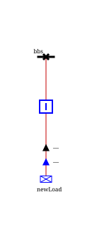{width="50%" align=center}

Class: `CreateFeederBay`

#### Create branch feeder bays
This class allows the creation of lines and two-winding transformers.
It takes as input:
- The `BranchAdder`, which should be created beforehand with the electrotechnical characteristics of the branch.
- The ID of the bus or busbar section (in `BUS_BREAKER` or `NODE_BREAKER` voltage levels respectively) to which the side
  1 of the branch should be connected.
- The ID of the bus or busbar section (in `BUS_BREAKER` or `NODE_BREAKER` voltage levels respectively) to which the side
  2 of the branch should be connected.
- The position order of the branch on side 1. If the voltage level on side 1 of the branch is `NODE_BREAKER`, then
  this integer is used to create the [`ConnectablePosition` extension](../grid_model/extensions.md#connectable-position)
  for the branch that is used for visualization and for positioning connectables relative to each other.
  It is optional for `BUS_BREAKER` voltage levels and will be ignored if specified.
- The position order of the branch on side 2. It is the same but on the other side.
- Optionally, a name for the feeder that will be added in the [`ConnectablePosition` extension](../grid_model/extensions.md#connectable-position)
  for side 1. This name is used for visualization. By default, it is the ID of the connectable.
- Optionally, a name for the feeder for side 2.
- Optionally, the direction of the feeder on side 1. This information will be used to fill the field in the
  [`ConnectablePosition` extension](../grid_model/extensions.md#connectable-position) and indicates the relative
  position of the branch with its busbar section on side 1. The default value is `TOP`.
- Optionally, the direction on side 2.
- Optionally, a boolean `logOrThrowIfIncorrectPositionOrder1`, that indicates what should happen if the position order is
incorrect on side 1 of the branch. This is mainly useful for voltage levels with `NODE_BREAKER` topology, since the
`ConnectablePosition` extension is not created otherwise. The order position may be incorrect if
  - it has already been taken on the busbar section,
  - if it is higher or lower than the maximum or minimum available order positions for the busbar section,
If the boolean is set to false, then the order position will be ignored and the `ConnectablePosition` extension will not be
created, but the `Branch` will. If the boolean is set to true, the `Branch` will not be created, and
either an exception will be thrown or a log will be returned, depending on the `throwException` boolean given when applying
the modification.
- Optionally, a boolean `logOrThrowIfIncorrectPositionOrder2`, which is the same but for the side 2 of the branch.

When the modification is applied on the network, the branch is added to both voltage levels and connected on the bus or
busbar section specified for both sides.
For each side, if the voltage level topology kind is `BUS_BREAKER`, then the branch is added to the voltage level and
connected to the bus without any extension or switches. If the voltage level topology kind is `NODE_BREAKER`, then the
branch is added to the voltage level and connected to the busbar section with a closed disconnector and a breaker.
Additionally, open disconnectors will be created on every parallel busbar section. To know which busbar sections are
parallel, the [`BusbarSectionPosition` extension](../grid_model/extensions.md#busbar-section-position)
is used. The [`ConnectablePosition` extension](../grid_model/extensions.md#connectable-position) will also be
created for the branch with the given data, unless no extensions are already available in the voltage level.

For instance, here is a `Substation`:
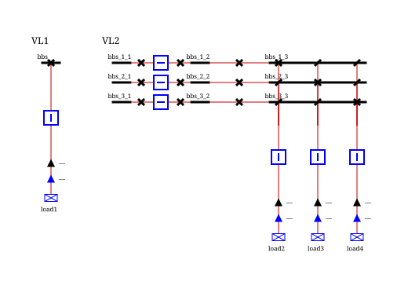{width="100%" align=center}
Adding a `TwoWindingsTransformer`  between both voltage levels of this substation will result in:
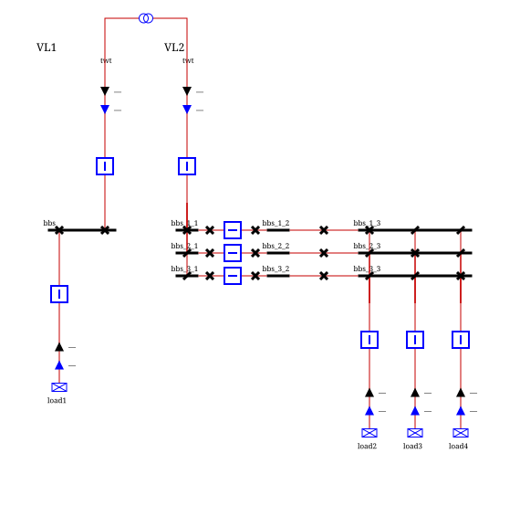{width="100%" align=center}

Class: `CreateBranchFeederBays`

#### Create coupling device
This class allows the creation of coupling devices within a voltage level to couple some busbar sections.
It takes as input:
- The ID of one bus or busbar section (in `BUS_BREAKER` or `NODE_BREAKER` voltage levels respectively)
- The ID of another bus or busbar section
- Optionally, a prefix to be used when creating the switches of the coupling device.

Both buses or busbar sections must be within the same voltage level.
If the voltage level has a `BUS_BREAKER` topology, then a new breaker is created between both buses.

If the voltage level has a `NODE_BREAKER` topology, then the coupling device is created between the two given buses or
busbar sections as such:
A closed disconnector will be created on both busbar sections.
A closed breaker will be created between the two closed disconnectors.
An open disconnector will be created on every parallel busbar section. To find the parallel busbar sections, the
[`BusbarSectionPosition` extension](../grid_model/extensions.md#busbar-section-position) is used.
The coupling device can be created between busbar sections that are parallel or not. If the two busbar sections are
parallel and there are exactly two parallel busbar sections, then no open disconnectors are created.

In the following single-line diagram, we can see three coupling devices added for each section and one coupling device 
between sections:  
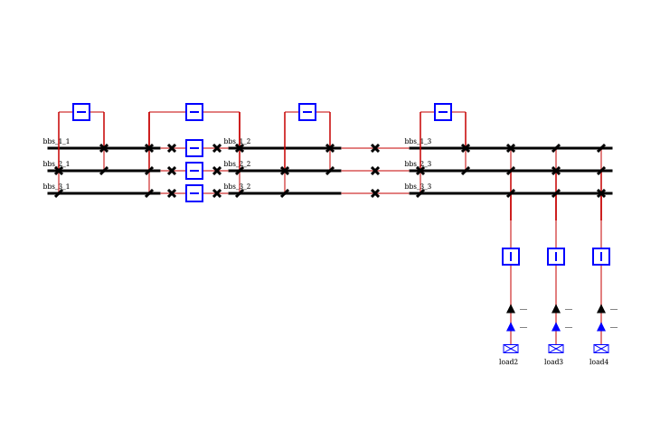{width="100%" align=center}

Class: `CreateCouplingDevice`

#### Create voltage level topology
This class allows the creation of the topology inside a voltage level if it is meant to be symmetrical.
The voltage level must already exist and does not have to be empty.
When applied to a network, it will create buses or busbar sections in a matrix of aligned buses or busbar sections.
In `BUS_BREAKER` topology, the buses will be separated by `Breakers` and in `NODE_BREAKER`, the switch type between each
section must be specified.
It takes as input:
- The ID of the voltage level
- The count of aligned buses or busbar sections. This integer indicates the "row" number of the matrix of buses or
  busbar sections.
- The section count. This integer indicates the "column" number of the matrix of buses or busbar sections.
- A list of switch kinds, for `NODE_BREAKER` voltage levels. This list indicates the switches that should be created
  between each busbar section.
  In the end, `alignedBusesOrBusbarCount` * `sectionCount` buses or busbar sections will be created, and they will be
  connected by section either by `Breakers` in `BUS_BREAKER` topology or by the switch specified by the list in `NODE_BREAKER`
  topology. The length of this list must be equal to the section count - 1.

Additional input can be provided:
- The low-bus or busbar section index. This integer indicates the index of the first "row" of buses or busbar sections
  that should be created. If the voltage level is not empty, then the buses or busbar sections will be created starting
  from this index, so it can be below some already existing buses or busbar sections. By default, it is 1 (no bus or
  busbar section already in the voltage level).
- The low-section index. This integer indicates the index of the first section of buses or busbar sections that should
  be created. If the voltage level is not empty, it is possible to create buses or busbar sections next to already
  existing ones. By default, it is 1 (no bus or busbar section already in the voltage level).
- The bus or busbar section prefix ID is optional and used, if specified, as a prefix for the IDs of the created buses
  or busbar sections. This prefix is followed by the "row" index and the section number. If it is not specified, then the
  name of the voltage level is used as a prefix.
- The switch prefix ID is also optional.
- The boolean connectExistingConnectables indicates whether existing connectables should be connected to the new topology
if the busbar sections are created in a non-empty voltage level. If true, they will all be connected with
an open switch of the same kind as the first switch that connects the connectable to the other busbar sections.
If this boolean is true, the [`ConnectFeedersToBusbarSections`](#connect-feeders-to-busbar-sections) modification will be called on the network.

For instance, this single-line diagram shows the result of calling this modification on an empty voltage level in `NODE_BREAKER` topology with:
- two aligned busbar sections
- three sections
- `Breakers` between the first and the second sections and `Disconnector` between the second and the third sections.
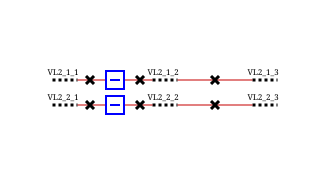{width="100%" align=center}

Class: `CreateVoltageLevelTopology`

#### Create voltage level sections
This class allows the creation of new busbar sections inside a voltage level in the NODE_BREAKER topology.
The voltage level must already have been created, must already contain some busbar sections, and these busbar sections 
must have the [`BusbarSectionPosition` extension](../grid_model/extensions.md#busbar-section-position),
which indicates their position in the voltage level busbar sections matrix (busbarIndex and sectionIndex).
When applied to a network, it will create new busbar sections before or after a reference busbar section.

It takes as input:
- The ID of the reference busbar section
- A boolean indicating if the new busbar section(s) must be created before(left) or after(right) the reference busbar section
- A boolean indicating if a new busbar section must be created on all busbars, or only on the busbar of the reference busbar section
- The switch kind of the new switch(es) that will be created left to the newly created busbar section :
  - DISCONNECTOR means that only a DISCONNECTOR switch will be created
  - BREAKER means that a BREAKER switch surrounded by two DISCONNECTOR switches will be created
- The switch kind of the new switch(es) that will be created right to the newly created busbar section :
  - DISCONNECTOR means that only a DISCONNECTOR switch will be created
  - BREAKER means that a BREAKER switch surrounded by two DISCONNECTOR switches will be created
- A boolean indicating if the new switches created left to the newly created busbar section(s) are fictitious
- A boolean indicating if the new switches created right to the newly created busbar section(s) are fictitious
- A boolean indicating if the new switches created left to the newly created busbar section(s) will be open
- A boolean indicating if the new switches created right to the newly created busbar section(s) will be open
- The switch prefix ID, used as a prefix for the IDs of the newly created switches.
- The busbar section prefix ID, used as a prefix for the IDs of the newly created busbar sections. This prefix
  is followed by the busbar index and the section index if the default naming strategy is used.

For instance, it is possible to add new busbar sections on the left of the voltage level:
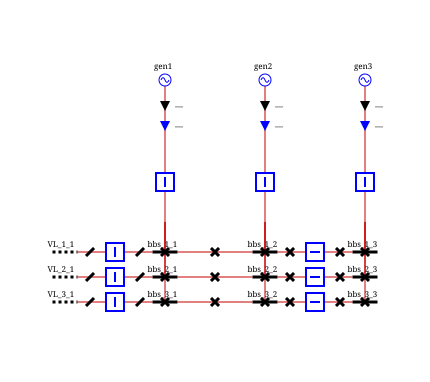{width="100%" align=center}

It is also possible to add new busbar sections on the right of the voltage level:
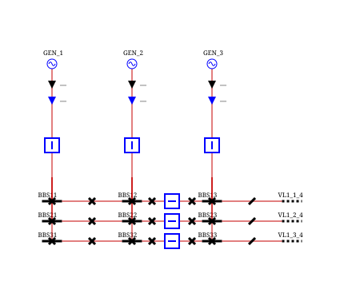{width="100%" align=center}

Or also between existing sections:
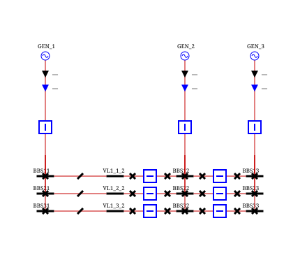{width="100%" align=center}

In all of these single-line diagrams, the busbar sections that are added are the ones that are not connected to any feeders.

Class: `CreateVoltageLevelSections`

### Connect feeders to busbar sections
This class allows the connection of feeders to busbar sections in `NODE_BREAKER` topology.
The [`ConnectablePosition` extension](../grid_model/extensions.md#connectable-position) must be available for each busbar section in the voltage level.

It takes as input:
- A list of connectables that should be connected. None of them should be a `BusbarSection`.
- A list of busbar sections. The connectables will be connected to these busbar sections if they are not already.
- A boolean `connectCouplingDevices` indicating if the coupling devices of the voltage level should be connected to the busbar sections.
If the busbar sections are not already connected on each side of the coupling device breaker, an open switch will be created.
- A string `couplingDeviceSwitchPrefixId` that will be used, if the boolean `connectCouplingDevices` is true, in the naming strategy
to determine the IDs of the new disconnectors.

When applied to a network, the network modification will loop through all the parallel busbar sections of each input busbar section to gather the
switches that are connecting the feeders. Then, the feeders and coupling devices will be connected by a switch of the same kind
as the first switch that connects the feeder to the other busbar sections. If all the feeders are already connected to the busbar sections,
then the network modification will do nothing.

Let's take an example. This is the voltage level before applying the modification:
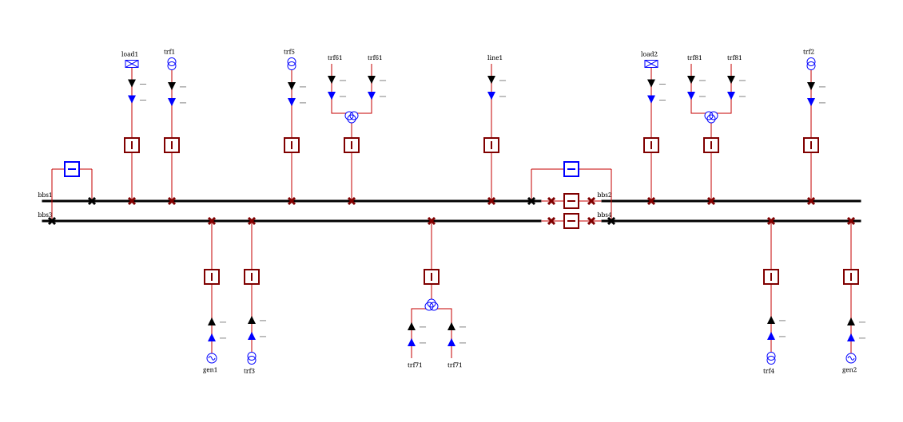{width="100%" align=center}

If we apply the modification with both busbar sections, all the connectables and coupling devices, we will get:
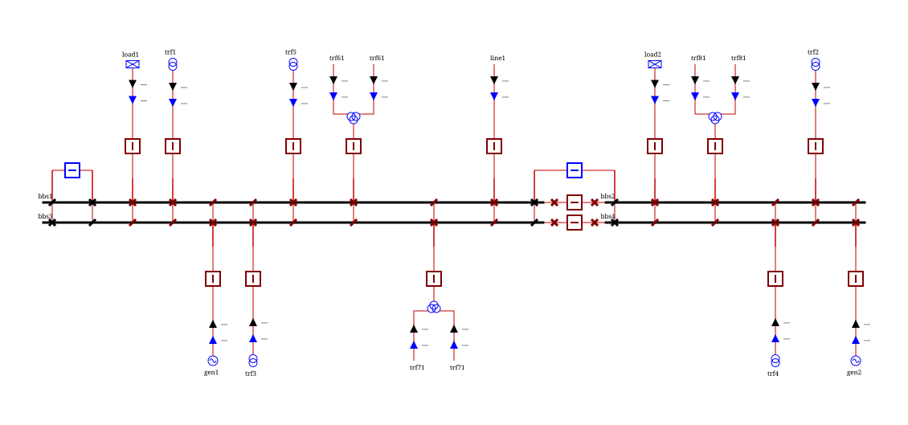{width="100%" align=center}

If we want to only connect the two-winding transformers on busbar section bbs3, we can specify the right lists as input and we will get:
{width="100%" align=center}

Class: `ConnectFeedersToBusbarSections`

### Network element removal

The classes `com.powsybl.iidm.modification.RemoveFeederBay`, `com.powsybl.iidm.modification.RemoveHvdcLine`,
`com.powsybl.iidm.modification.RemoveVoltageLevel` and `com.powsybl.iidm.modification.RemoveSubstation` allow to remove
all types of elements from a network.

#### Remove feeder bay
This is the class to use to remove any Injection, Branch or Three-winding transformer.
The builder should be used to create any instance of this class. Only the ID of the connectable to remove should be given
as input.
When applied to the network, the connectable will be removed, as well as all the switches connecting it to busbar sections.
Note: Busbar sections are not allowed to be removed with this class.

Class: `RemoveFeederBay`

#### Remove HVDC line
This class should be used to remove an HVDC line.
The input arguments are:
- The ID of the HVDC line
- If the HVDC line is an LCC, an optional list of IDs of the shunt compensators associated with this HVDC line that should also be removed.
  When applied to the network, the HVDC line is removed, as well as the two converter stations on each side and the
  switches connecting them to their voltage levels. If the list of shunt compensators is not empty, then they will also be
  removed along with their switches.

Class: `RemoveHvdcLine`

#### Remove voltage level
This class is used to remove an entire voltage level. All the connectables, busbar sections, coupling devices of the voltage level
are removed. The lines, two-winding transformers and three-winding transformers are also removed as well as their
switches in other voltage levels.
The builder to be used to initialize this class takes only the ID of the voltage level to be removed.

Class: `RemoveVoltageLevel`

#### Remove substation
This class should be used to remove an entire substation. All the voltage levels of the substation with all their
connectables are removed. The branches and three-winding transformers are also removed with their switches in the other
substations.
The builder takes the ID of the substation as input.

Class: `RemoveSubstation`

### Move network elements

#### Move feeder bay
This class is used to move feeder bays of connectables
(except `BusOrBusBarSection` connectables) from one place to another within a network.

This class allows moving a feeder bay from one busbar section to another within the network.
The builder should be used to create any instance of this class. It takes as input:

- The ID of the connectable whose feeder bay will be moved (`connectableId`). Note that `BusOrBusBarSection` connectables are not accepted.
- The ID of the target bus or busbar section (`targetBusOrBusBarSectionId`) to which the feeder bay should be connected.
- The ID of the target voltage level (`targetVoltageLevelId`) where the feeder bay will be moved to.
- The terminal object that specifies which terminal of the connectable should be moved.

When the modification is applied on the network, the system identifies and updates all relevant switches and connections
to move the feeder bay from its current position to the specified target place. This includes disconnecting
from the original busbar section and reconnecting to the target busbar section.
If the target voltage level topology kind is `BUS_BREAKER`, the connectable is connected to the target bus without additional switches.
If the target voltage level topology kind is `NODE_BREAKER`, the appropriate disconnectors and breakers are created to connect
the feeder bay to the target busbar section, maintaining the correct topology.
This modification ensures that the connectivity of the network is preserved while moving the feeder bay to its new position.

For instance, this is a voltage level: 
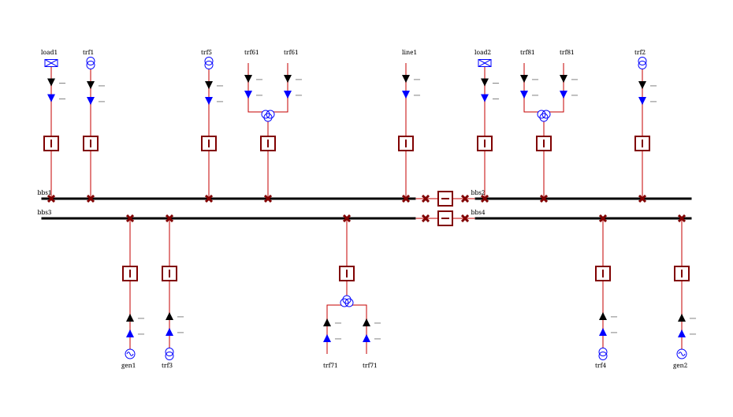
With this modification, we can easily move load1 to another voltage level, like vl2:
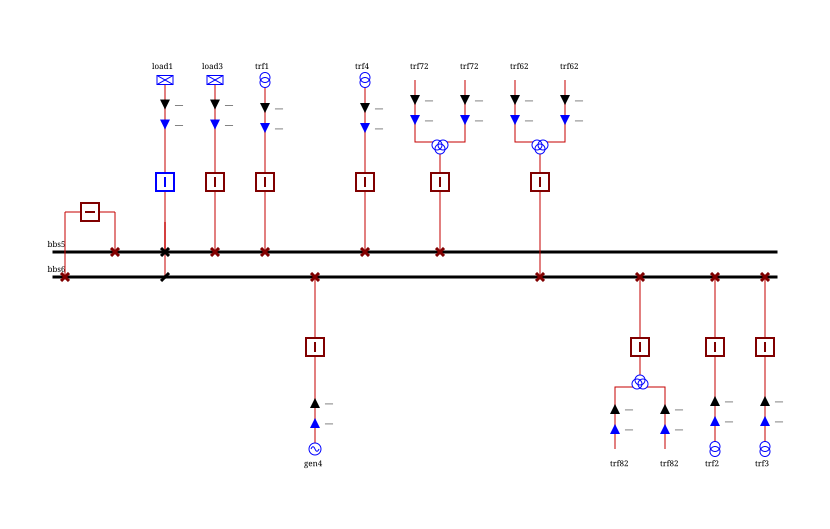
Class: `MoveFeederBay`

### Line splitting and tapping

#### Connect voltage level on line
This class cuts an existing line into two new lines that are connected to an existing voltage level (the "switching voltage level").
The switching voltage level should be added to the network just before calling this method and should contain
at least a bus in `BUS_BREAKER` topology or a busbar section in `NODE_BREAKER` topology.

It takes as input:
- The original line to be cut.
- The percentage to split the electrical characteristics of the original line (R, X, B, etc.).
- The ID of the bus or busbar section in the switching voltage level where the lines will be connected.
- The IDs for the two new line segments.
- Optionally, names for the two new line segments.
- Optionally, position orders for the new lines to create [`ConnectablePosition` extensions](../grid_model/extensions.md#connectable-position) for visualization.

When applied, the original line is removed and two new lines are created. Switches are automatically created in the 
switching voltage level to connect the new lines to the specified bus or busbar section, according to the voltage level topology.

For instance, let's look at this network area diagram of a network with three voltage levels:

We can connect a fictitious voltage level `VL_TEST` on the line between `VL3` and `VL2` and the associated network area diagram is:
The line between `VL3` and `VL2` is now connected to the fictitious voltage level `VL_TEST` and cut in two lines.

Class: `ConnectVoltageLevelOnLine`

#### Revert voltage level connection
This class reverses the action performed by `ConnectVoltageLevelOnLine`. It replaces two existing lines that share a 
common voltage level at one of their ends with a single new line.

It takes as input:
- The IDs of the two lines to be merged.
- The ID for the new merged line.
- Optionally, a name for the new merged line.

When applied, the two lines are removed and replaced by a single line connecting the two outer voltage levels. 
The common switching voltage level is removed if it no longer contains any equipment (except for buses or busbar sections).

Class: `RevertConnectVoltageLevelOnLine`

#### Create line tee point
This class connects an existing voltage level to an existing line through a tee point.
It cuts the existing line in two, creating a fictitious voltage level (the tee point) between them, and then connects the 
existing voltage level to this tee point with a new line.

It takes as input:
- The percentage to split the original line at the tee point.
- The ID of the bus or busbar section in the existing voltage level to be connected.
- The ID for the fictitious voltage level.
- Optionally, the name for the fictitious voltage level.
- A boolean indicating whether to create a fictitious substation for the tee point.
- The IDs for the two line segments.
- Optionally, the name for the two line segments.
- The original line to be cut.
- The `LineAdder` for the new line connecting the existing voltage level to the tee point.
- Optionally, a position order for the new line connection to create [`ConnectablePosition` extensions](../grid_model/extensions.md#connectable-position) for visualization.

For instance, let's look at this network area diagram of a network with three voltage levels:

We can connect a fictitious voltage level `VL_TEST` on the line between `VL3` and `VL2` through a tee point, and the associated network area diagram is:
The line between `VL3` and `VL2` is now connected to the fictitious voltage level `VL_TEST` via a new line. 
A fictitious voltage level has been created to represent the tee point.

Class: `CreateLineOnLine`

#### Revert line tee point
This class reverses the action performed by `CreateLineOnLine`. It replaces three existing lines that meet at a common tee point with a single new line.

It takes as input:
- The IDs of the two lines to be merged (those forming the original path).
- The ID of the line to be removed (the one connecting to the tapped voltage level).
- The ID for the new merged line.
- Optionally, a name for the new merged line.

When applied, the three lines are removed and replaced by a single line. The tee point voltage level and the tapped voltage level 
are removed if they become empty (except for buses or busbar sections).

Class: `RevertCreateLineOnLine`

#### Replace tee point by voltage level
This class transforms a tee point configuration into a switching voltage level configuration. It replaces three existing 
lines meeting at a tee point with two new lines connected to the formerly tapped voltage level, which now acts as a switching voltage level.

It takes as input:
- The IDs of the three lines connected to the tee point.
- The ID of the existing bus or busbar section in the tapped voltage level where the new lines will be connected.
- The IDs for the two new lines.
- Optionally, names for the two new lines.

When applied, the three lines and the tee point are removed, and two new lines are created connecting the two original ends to the formerly tapped voltage level.

Class: `ReplaceTeePointByVoltageLevelOnLine`

## Tripping
Tripping modifications are used to disconnect network elements by opening the appropriate switches.

### General principles
The tripping modifications rely on a topological traversal to identify which switches should be opened:
- In **Node/Breaker** topology, the traversal starts from the equipment terminal and searches for the nearest closed, non-fictitious `BREAKER`. 
If such a breaker is found, it is opened.
- In **Bus/Breaker** topology, the traversal stops at the terminal, and the terminal is simply disconnected.
- For **DC** equipment, the traversal searches for the nearest closed, non-fictitious DC switch.

Most tripping modifications for multi-terminal equipment (like lines or transformers) allow for side-specific tripping by 
providing a voltage level ID. If no voltage level ID is specified, all sides are tripped.

### Comparison with disconnection
Tripping differs from **Planned Disconnection** in the way it handles switches in **Node/Breaker** topology. While a planned 
disconnection aims to fully isolate a piece of equipment (e.g., for maintenance) by opening both breakers and disconnectors, 
tripping mimics a protection system by opening only the **breakers** necessary to interrupt the current. See [Disconnections](#disconnections) for more details.

### Battery tripping
This modification trips a battery by opening the switches connected to its terminal.

It takes as input:
- The ID of the battery to trip.

Class: `BatteryTripping`

### Branch tripping
This modification trips a branch (line or two-winding transformer) by opening the switches connected to its terminals.

It takes as input:
- The ID of the branch to trip.
- Optionally, a voltage level ID to restrict the tripping to a single side.

Class: `BranchTripping`

### Busbar section tripping
This modification trips a busbar section by opening the switches connected to its terminal.

It takes as input:
- The ID of the busbar section to trip.

Class: `BusbarSectionTripping`

### Bus tripping
This modification trips a bus by opening the switches connected to all the terminals associated with the bus.

It takes as input:
- The ID of the bus to trip.

Class: `BusTripping`

### Boundary line tripping
This modification trips a boundary line by opening the switches connected to its terminal.

It takes as input:
- The ID of the boundary line to trip.

Class: `BoundaryLineTripping`

### DC ground tripping
This modification trips a DC ground by opening the switches connected to all its DC terminals.

It takes as input:
- The ID of the DC ground to trip.

Class: `DcGroundTripping`

### DC line tripping
This modification trips a DC line by opening the DC switches connected to its terminals.

It takes as input:
- The ID of the DC line to trip.
- Optionally, a DC node ID to restrict the tripping to a single side.

Class: `DcLineTripping`

### DC node tripping
This modification trips a DC node by opening the switches connected to all the DC terminals associated with the DC node.

It takes as input:
- The ID of the DC node to trip.

Class: `DcNodeTripping`

### Generator tripping
This modification trips a generator by opening the switches connected to its terminal.

It takes as input:
- The ID of the generator to trip.

Class: `GeneratorTripping`

### HVDC line tripping
This modification trips an HVDC line by opening the switches connected to its converter stations terminals.

It takes as input:
- The ID of the HVDC line to trip.
- Optionally, a voltage level ID to restrict the tripping to a single side.

Class: `HvdcLineTripping`

### Line tripping
This modification trips a line by opening the switches connected to its terminals.

It takes as input:
- The ID of the line to trip.
- Optionally, a voltage level ID to restrict the tripping to a single side.

Class: `LineTripping`

### Load tripping
This modification trips a load by opening the switches connected to its terminal.

It takes as input:
- The ID of the load to trip.

Class: `LoadTripping`

### Shunt compensator tripping
This modification trips a shunt compensator by opening the switches connected to its terminal.

It takes as input:
- The ID of the shunt compensator to trip.

Class: `ShuntCompensatorTripping`

### Static var compensator tripping
This modification trips a static var compensator by opening the switches connected to its terminal.

It takes as input:
- The ID of the static var compensator to trip.

Class: `StaticVarCompensatorTripping`

### Switch tripping
This modification trips a switch by directly opening it. Unlike other tripping modifications, it does not perform a topological traversal to find breakers.

It takes as input:
- The ID of the switch to trip.

Class: `SwitchTripping`

### Three-winding transformer tripping
This modification trips a three-winding transformer by opening the switches connected to the terminals of its three legs.

It takes as input:
- The ID of the three-winding transformer to trip.

Class: `ThreeWindingsTransformerTripping`

### Tie line tripping
This modification trips a tie line by opening the switches connected to its boundary lines terminals.

It takes as input:
- The ID of the tie line to trip.
- Optionally, a voltage level ID to restrict the tripping to a single side.

Class: `TieLineTripping`

### Two-winding transformer tripping
This modification trips a two-winding transformer by opening the switches connected to its terminals.

It takes as input:
- The ID of the two-winding transformer to trip.
- Optionally, a voltage level ID to restrict the tripping to a single side.

Class: `TwoWindingsTransformerTripping`

### Voltage source converter tripping
This modification trips a voltage source converter (VSC) by opening the switches connected to all its AC and DC terminals.

It takes as input:
- The ID of the converter to trip.

Class: `VoltageSourceConverterTripping`

## Other modifications

### Modification list
This modification is used to apply a list of any Powsybl `NetworkModification`.

Class: `NetworkModificationList`

### Area interchange target
This modification is used to update the target of an area interchange.

The target is in MW in load sign convention (negative for export, positive for import).
Providing `Double.NaN` removes the target.

Class: `AreaInterchangeTargetModification`

### Battery setpoints
This modification is used to update the target powers (active `targetP` and reactive `targetV`) of a battery.

Class: `BatteryModification`

### Connectable connection
This modification is used to connect a network element to the closest bus or busbar section.

It works on:
- `Connectable` elements by connecting their terminals
- HVDC lines, by connecting the terminals of their converter stations
- Tie lines, by connecting the terminals of their underlying boundary lines

It is possible to specify a side of the element to connect. If no side is specified, the network modification will try to connect every side.

Class: `ConnectableConnection`

### Boundary line injections
This modification is used to update the active and reactive powers of the load part of a boundary line.

If `relativeValue` is set to true, then the new constant active power (`P0`) and reactive power (`Q0`) are set as the addition of the given values to the previous ones.
If `relativeValue` is set to false, then the new constant active power (`P0`) and reactive power (`Q0`) are updated to the new given values.

Class: `BoundaryLineModification`

### Disconnections
Disconnection modifications are used to logically disconnect a network element. Unlike tripping, they are generic and can be applied to any connectable element.

#### Planned
This modification is used to disconnect a network element from the bus or busbar section to which it is currently connected. 
It should be used if the disconnection is planned (e.g., for maintenance). If it is not, `UnplannedDisconnection` should be used instead.

In **Node/Breaker** topology, it opens **all switches** (both breakers and disconnectors) to fully isolate the equipment from the busbar.

It works on:
- `Connectable` elements.
- HVDC lines, by disconnecting their converter stations
- Tie lines, by disconnecting their underlying boundary lines

It is possible to specify a side of the element to disconnect. If no side is specified, the network modification will try to disconnect every side.

Class: `PlannedDisconnection`

#### Unplanned
This modification is used to disconnect a network element from the bus or busbar section to which it is currently connected. 
It should be used if the disconnection is unplanned.  If it is not, `PlannedDisconnection` should be used instead.

In **Node/Breaker** topology, it mimics tripping by opening only the **breakers** necessary to interrupt the current, leaving disconnectors closed.

It works on:
- `Connectable` elements.
- HVDC lines, by disconnecting their converter stations
- Tie lines, by disconnecting their underlying boundary lines

It is possible to specify a side of the element to disconnect. If no side is specified, the network modification will try to disconnect every side.

Class: `UnplannedDisconnection`

### Generator modifications

#### Update attributes
This modification is used to apply a set of modifications on a generator.

The data to be updated are optional among:
- `minP`, the minimum active power boundary in MW.
- `maxP`, the maximum active power boundary in MW.
- `targetV`, the target voltage value in kV.
- `targetQ`, the target reactive power value in MVAR.
- `connected`, the connection state of the generator terminal.
- `voltageRegulatorOn`, to activate or deactivate the generator voltage regulator status. If `true` and the generator target voltage is not set then an acceptable value for the generator `targetV` is computed before activating.
- The active power if `targetP` or `deltaTargetP` are given. An active power is determined by the new `targetP` if given, and if not then the `deltaTargetP` is considered instead and the new value of the generator `targetP` is the addition of the old generator value with the given delta target P value. Then, according to the given `ignoreCorrectiveOperations` parameter:
  - If `ignoreCorrectiveOperations` is true, this determined active power is applied as the new generator target P value.
  - If `ignoreCorrectiveOperations` is false, then the new active power will also depend on the limits and will be the minimum value between the generator `maxP` and the maximum value between the generator `minP` and the previously determined active power value. Besides, if the generator connection state has not been updated before within this `NetworkModification` then the generator is connected if necessary.

Class: `GeneratorModification`

#### Connect generator
This modification is used to connect a given generator.

If the generator terminal is regulating then it will also set its target voltage if an acceptable value is found.

Class: `ConnectGenerator`

#### Set to local regulation
This modification is used to set the generator regulating terminal to a local regulation.

The target voltage value is set to the same value for all the generators of the bus that are regulating locally.
In case other generators are already regulating locally on the same bus, targetV value is determined by being the closest value to the voltage level nominal voltage among the regulating terminals.
If no other generator is regulating on the same bus, targetV engineering unit value is adapted to the voltage level nominal voltage, but the per unit value remains the same.

Class: `SetGeneratorToLocalRegulation`

### HVDC line modifications
This modification is used to modify a given HVDC line (and potentially its angle droop active power control extension).

- Modify the HVDC line `activePowerSetpoint` if given, relatively to the existent `activePowerSetpoint` if `relativeValue` is true or as a replacement value if not.
- Modify the `convertersMode` with the given one if set
- Modify the angle droop active power control extension (if existing but will not crash if not found for the HVDC line):
  - Enable or disable the AC emulation if `acEmulationEnabled` is provided
  - Update the active power if `p0` is provided
  - Update the droop in MW/degree if `droop` is provided

Class: `HvdcLineModification`

### Load modifications

#### Update active and reactive power
This modification updates the `P` and `Q` values of the load.

If `relativeValue` is set to true, then the new constant active power (`P0`) and reactive power (`Q0`) are set as the addition of the given values to the previous ones.
If `relativeValue` is set to false, then the new constant active power (`P0`) and reactive power (`Q0`) are updated to the new given values.

Class: `LoadModification`

#### Percent change
This modification is used to add or remove a percentage of the P and Q of the load. The percentage to add or remove for P and Q cannot be less than -100 (in percentage).

Class: `PercentChangeLoadModification`

### Phase shifter modifications

#### Optimize tap
This modification is used to find the optimal phase tap changer position of a given two-winding transformer phase shifter id.

A phase shifter optimization load flow is run with the configured `load-flow-based-phase-shifter-optimizer` to determine the optimal tap position.

Class: `PhaseShifterOptimizeTap`

#### Set fixed tap
This modification updates the phase tap changer of a given two-winding transformer phase shifter id.

It updates its `tapPosition` with the given value and set the phase tap changer as not regulating.

Class: `PhaseShifterSetAsFixedTap`

#### Shift tap
This modification is used to update the phase tap changer of a given two-winding transformer phase shifter id.

It sets the phase tap changer as not regulating and updates its `tapPosition` by adjusting it with the given `tapDelta` applied on the current tap position. The resulting tap position is bounded by the phase tap changer lowest and highest possible positions.

Class: `PhaseShifterShiftTap`

### Replace tie lines by lines
This modification is used to replace all the tie lines of a network with simple lines built from the original tie line and its 2 boundary lines.

- The two voltage levels are set from the tie line boundary lines terminal voltage levels (the first voltage level from the first boundary line and the second from the second one).
- For each voltage level the topology kind is taken into account to create node (for `NODE_BREAKER` kind) or bus and connectable bus (for `BUS_BREAKER` kind)
- The tie line id, name, r, x, b1, b2, g1, g2 are set in the new line
- Active power limits, apparent power limits and current limits are set on each side of the line from the limits of the 2 boundary lines
- Terminal active and reactive powers are set for both terminals from each boundary line active and reactive powers
- Line properties are set from the merge of the tie line and its 2 boundary lines properties
- Line aliases are set from the merge of the tie line and its 2 boundary lines aliases
- If the tie line has a pairing key then it is added to the new line as a pairing key alias
- The tie line and its boundary lines are removed from the network

Class: `ReplaceTieLinesByLines`

### Shunt compensator modifications
This modification is used to (dis)connect a shunt compensator and/or change its section count in service.

If the modification connects the shunt compensator and its terminal is regulating then it will also set its target voltage if an acceptable value is found.

Class: `ShuntCompensatorModification`

### Static var compensator modifications
This modification modifies the voltage and reactive power setpoints of a static var compensator, following a load convention.

Class: `StaticVarCompensatorModification`

### Switch modifications
#### Close switch
This modification is used to close a switch.

Class: `CloseSwitch`

#### Open switch
This modification is used to open a switch.

Class: `OpenSwitch`

### Transformer modifications

#### Leg rated voltage
This modification is used to modify the rated voltage of each leg of a three-winding transformer.

On each leg the new rated voltage is computed from the given common rated voltage multiplied by the ratio (leg old rated voltage / rated voltage of the three-winding transformer (the `ratedU0` also used as nominal voltage) at the fictitious bus (in kV)).

Class: `ThreeWindingsTransformerModification`

#### Replace three-winding transformer by 3 two-winding transformers
This modification is used to replace all or a given list of `ThreeWindingsTransformer` by triplets of `TwoWindingsTransformer`.

For each `ThreeWindingsTransformer` to be replaced:
- A new voltage level is created for the star node with nominal voltage of ratedU0.
- Three `TwoWindingsTransformers` are created, one for each leg of the `ThreeWindingsTransformer` to transform.
- The following attributes are copied from each leg to the new associated `TwoWindingsTransformer`:
  - Electrical characteristics, ratio tap changers, and phase tap changers. No adjustments are required.
  - Operational Loading Limits are copied to the non-star end of the two-winding transformers.
  - Active and reactive powers at the terminal are copied to the non-star terminal of the two-winding transformer.
- Aliases:
  - Aliases for known CGMES identifiers (terminal, transformer end, ratio, and phase tap changer) are copied to the right `TwoWindingsTransformer` after adjusting the alias type.
  - Aliases that are not mapped are recorded in the functional log.
- Properties:
  - Star bus voltage and angle are set to the bus created for the star node.
  - The names of the operational limits are copied to the right `TwoWindingsTransformer`.
  - The rest of the properties of the `ThreeWindingsTransformer` are transferred to all 3 `TwoWindingsTransformer`.
- Extensions:
  - Only IIDM extensions are copied: `TransformerFortescueData`, `PhaseAngleClock`, and `TransformerToBeEstimated`.
  - CGMES extensions cannot be copied, as they cause circular dependencies.
  - Extensions that are not copied are recorded in the functional log.
- All the controllers using any of the `ThreeWindingsTransformer` terminals as regulated terminal are updated.
- New and removed equipment is recorded in the functional log.
- Internal connections are created to manage the replacement.

Class: `ReplaceThreeWindingsTransformersBy3TwoWindingsTransformers`

#### Replace 3 two-winding transformers by a three-winding transformer
This modification is used to replace all or a given list of `TwoWindingsTransformer` by `ThreeWindingsTransformer`.

In the list of `TwoWindingsTransformer` if only one of a triplet of `TwoWindingsTransformer` is given then the 3 `TwoWindingsTransformer` will be transformed to a `ThreeWindingsTransformer`.

Conditions to detect a triplet of `TwoWindingsTransformer` to transform:
- `BusbarSections` and the three `TwoWindingsTransformer` are the only connectable equipment allowed in the voltage level associated with the star bus.
- The three `TwoWindingsTransformer` must be connected to the star bus.
- The star terminals of the two-winding transformers must not be regulated terminals for any controller.
- Each `TwoWindingsTransformer` is well oriented if the star bus is located at the end 2.

Then a `ThreeWindingsTransformer` is created to replace them:
- The following attributes are copied from each `TwoWindingsTransformer` to the new associated leg:
  - Electrical characteristics, ratio tap changers, and phase tap changers. Adjustments are required if the `TwoWindingsTransformer` is not well oriented.
  - Only the operational loading limits defined at the non-star end are copied to the leg.
  - Active and reactive powers at the non-star terminal are copied to the leg terminal.
- Aliases:
  - Aliases for known CGMES identifiers (terminal, transformer end, ratio, and phase tap changer) are copied to the `ThreeWindingsTransformer` after adjusting the alias type.
  - Aliases that are not mapped are recorded in the functional log.
- Properties:
  - Voltage and angle of the star bus are added as properties of the `ThreeWindingsTransformer`.
  - Only the names of the transferred operational limits are copied as properties of the `ThreeWindingsTransformer`.
  - All the properties of the first `TwoWindingsTransformer` are transferred to the `ThreeWindingsTransformer`, then those of the second that are not in the first, and finally, the properties of the third that are not in the first two.
  - Properties that are not mapped are recorded in the functional log.
- Extensions:
  - Only IIDM extensions are copied: `TransformerFortescueData`, `PhaseAngleClock`, and `TransformerToBeEstimated`.
  - CGMES extensions cannot be copied, as they cause circular dependencies.
  - Extensions that are not copied are recorded in the functional log.
- All the controllers using any of the `TwoWindingsTransformer` terminals as regulated terminal are updated.
- New and removed equipment is recorded in the functional log.
- Internal connections are created to manage the replacement.

Class: `Replace3TwoWindingsTransformersByThreeWindingsTransformers`

### Tap changer modifications

#### Phase tap position
This modification is used to modify a phase tap changers tap position of a given `PhaseTapChangerHolder` (for two or three-winding transformer).

The new tap position can be either the one given in parameter or a relative position added to the existing one.
The `PhaseTapChangerHolder` can be from:
- A two-winding transformer
- A three-winding transformer with a single phase tap changer
- A leg of a three-winding transformer

Class: `PhaseTapPositionModification`

#### Ratio tap position
This modification is used to modify a ratio tap changers tap position of a given `RatioTapChangerHolder` (for two or three-winding transformer).

The `RatioTapChangerHolder` can be from:
- A two-winding transformer
- A three-winding transformer with a single ratio tap changer
- A leg of a three-winding transformer

Class: `RatioTapPositionModification`

### VSC converter station modifications
This modification is used to modify the voltage and reactive power setpoints of a VSC converter station, following a generator convention.

Class: `VscConverterStationModification`
