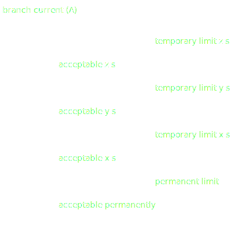
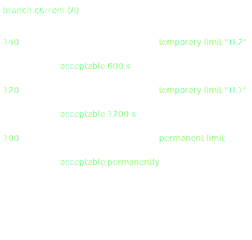
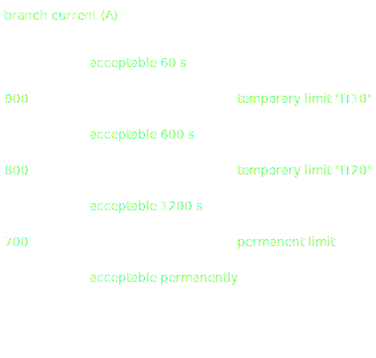

# Advanced

Network elements can be described in an advanced way with reactive limits, loading limits, phase and ratio tap changers.

## Reactive limits
[](https://javadoc.io/doc/com.powsybl/powsybl-core/latest/com/powsybl/iidm/network/ReactiveLimits.html)

The reactive limits may be used to model limitations of the reactive power of
[generators](./network_subnetwork.md#generator), [VSC converter stations](./network_subnetwork.md#vsc-converter-station) and [batteries](./network_subnetwork.md#battery).

(min-max-reactive-limits)=
### Min-Max reactive limits
With the min-max reactive limits, the reactive power does not depend on the active power. For any active power value, the reactive power value is in the [minQ, maxQ] interval.

(reactive-capability-curve)=
### Reactive capability curve
With the reactive capability curve limits, the reactive power limitation depends on the active power value. This dependency is based on a curve provided by the user.
The curve is defined as a set of points that associate, to each active power value, a minimum and maximum reactive power value.
In between the defined points of the curve, the reactive power limits are computed through a linear interpolation.

### Examples

This example shows how to use the `MinMaxReactiveLimits` and `ReactiveCapabilityCurve` classes:
```java
Generator generator = network.getGenerator("G");
if (generator.getReactiveLimits().getKind() == ReactiveLimitsKind.MIN_MAX) {
    MinMaxReactiveLimits limits = generator.getReactiveLimits(MinMaxReactiveLimits.class);
    System.out.println("MinMaxReactiveLimits: [" + limits.getMinQ() + ", " + limits.getMaxQ() + "]");
} else {
    ReactiveCapabilityCurve limits = generator.getReactiveLimits(ReactiveCapabilityCurve.class);
    System.out.println("ReactiveCapabilityCurve:");
    limits.getPoints().forEach(p -> System.out.println("\t" + p.getP() + " -> [" + p.getMinQ() + ", " + p.getMaxQ() + "]"));
}
```

This example shows how to create a new `MinMaxReactiveLimits` object:
```java
Generator generator = network.getGenerator("G");
generator.newMinMaxReactiveLimits()
    .setMinQ(-100.0)
    .setMaxQ(100.0)
    .add();
```

This example shows how to create a new `ReactiveCapabilityCurve` object:
```java
Generator generator = network.getGenerator("G");
generator.newReactiveCapabilityCurve()
    .beginPoint()
        .setP(-10)
        .setMinQ(-10)
        .setMaxQ(10)
    .endPoint()
    .beginPoint()
        .setP(0)
        .setMinQ(-20)
        .setMaxQ(20)
    .endPoint()
    .beginPoint()
        .setP(10)
        .setMinQ(-15)
        .setMaxQ(-15)
    .endPoint()
    .add();
```

(loading-limits)=
## Loading Limits
[](https://javadoc.io/doc/com.powsybl/powsybl-core/latest/com/powsybl/iidm/network/LoadingLimits.html)

Some equipment has operational limits regarding the current, active power or apparent power value, corresponding to the equipment's physical limitations (related to heating).

Loading limits can be declined into active power limits (in MW), apparent power limits (in kVA) and current limits (in A).
They may be set for [lines](./network_subnetwork.md#line),
[dangling lines](./network_subnetwork.md#dangling-line), [two-winding transformers](./network_subnetwork.md#two-winding-transformer) and [three-winding transformers](./network_subnetwork.md#three-winding-transformer). The active power limits are in absolute value.

Loading limits are defined by one permanent limit and any number of temporary limits (zero or more).
The permanent limit sets the current, active power or apparent power absolute value under which the equipment can safely
be operated for any duration.
The temporary limits can be used to define higher current, active power or apparent power limitations corresponding
to specific operational durations.
A temporary limit thus has an **acceptable duration**.

The component on which the current limits are applied can safely remain
between the preceding limit (it could be another temporary limit or a permanent limit) and this limit for a duration up to the acceptable duration.
Please look at this scheme to fully understand the modeling (the following example shows current limits, but this modeling is valid for all loading limits):

{width="50%" align=center class="only-light"}
{width="50%" align=center class="only-dark"}

Note that, following this modeling, in general, the last temporary limit (the higher one in value) should be infinite with an acceptable duration different from zero, except for tripping current modeling where the last temporary limit is infinite with an acceptable duration equal to zero. If temporary limits are modeled, the permanent limit becomes mandatory.

(limit-group-collection)=
### Limit group collection
In network development studies or in an operational context (CGMES), we can have a set of operational limits according to the season (winter vs summer, for example), the time of the day (day vs night) etc.
In PowSyBl, users can store a collection of limits:
- Active power limits, apparent power limits and current limits are gathered into an `OperationalLimitsGroup` object.
- Lines and transformers are associated with a collection of `OperationalLimitsGroup` (one collection per side/leg).
  Users can then choose the active set according to their needs.

`OperationalLimitsGroup` objects have an `id`, and may have properties — which allow associating additional arbitrary data items under the general schema of pairs <Key, Value>.  
Note that unlike the properties on the network components, no notification is emitted when a property is added, changed or removed.

#### Examples

Three examples are provided below, with their corresponding limits scheme, to show clearly how to create new `CurrentLimits` instances.

##### First example
This first example creates a `CurrentLimits` instance containing one permanent limit and two temporary limits.
```java
CurrentLimits currentLimits = network.getDanglingLine("DL").newCurrentLimits()
    .setPermanentLimit(100.0)
    .beginTemporaryLimit()
        .setName("TL1")
        .setValue(120.0)
        .setAcceptableDuration(20 * 60)
    .endTemporaryLimit()
    .beginTemporaryLimit()
        .setName("TL2")
        .setValue(140.0)
        .setAcceptableDuration(10 * 60)
    .endTemporaryLimit()
    .add();
```
{align=center class="only-light"}
{align=center class="only-dark"}

##### Second example
This second example creates a `CurrentLimits` instance containing one permanent limit and three temporary limits, one of them having an infinite limit value.
```java
CurrentLimits currentLimits = network.getDanglingLine("DL").newCurrentLimits()
    .setPermanentLimit(700.0)
    .beginTemporaryLimit()
        .setName("IT20")
        .setValue(800.0)
        .setAcceptableDuration(20 * 60)
    .endTemporaryLimit()
    .beginTemporaryLimit()
        .setName("IT10")
        .setValue(900.0)
        .setAcceptableDuration(10 * 60)
    .endTemporaryLimit()
    .beginTemporaryLimit()
        .setName("IT1")
        .setValue(Double.POSITIVE_INFINITY)
        .setAcceptableDuration(60)
    .endTemporaryLimit()
    .add();
```
{align=center class="only-light"}
{align=center class="only-dark"}

##### Third example
This third example shows how to create multiple OperationalLimitsGroup on the same end, and set one of these as the selected (active) one.
```java
Line line = network.getLine("Line");

line.newOperationalLimitsGroup1("SUMMER")
        .newCurrentLimits()
        .setPermanentLimit(60)
        .beginTemporaryLimit()
        .setName("TATL-10")
        .setValue(80)
        .setAcceptableDuration(10 * 60)
        .endTemporaryLimit()
        .add();

line.newOperationalLimitsGroup1("WINTER")
        .newCurrentLimits()
        .setPermanentLimit(100)
        .beginTemporaryLimit()
        .setName("TATL-10")
        .setValue(120)
        .setAcceptableDuration(10 * 60)
        .endTemporaryLimit()
        .add();

line.setSelectedOperationalLimitsGroup1("WINTER");
```
In this example, there is two sets of limits on the same line side (1). The selected set is the winter one: the limits violations will be tested against this set.

(phase-tap-changer)=
## Phase tap changer
[](https://javadoc.io/doc/com.powsybl/powsybl-core/latest/com/powsybl/iidm/network/PhaseTapChanger.html)

A phase tap changer can be added to either [two-winding transformers](./network_subnetwork.md#two-winding-transformer) or [three-winding transformers' legs](./network_subnetwork.md#three-winding-transformer-leg).

**Specifications**

A phase tap changer is described by a set of tap positions (or steps) within which the transformer or transformer leg can operate. Additionally, to that set of steps, it is necessary to specify:
- the lowest tap position
- the highest tap position
- the position index of the current tap (which has to be within the highest and lowest tap position bounds)
- whether the phase tap changer can change tap positions onload or only offload

If the phase tap changer can change tap positions onload, regulation is specified as follows:
- whether the tap changer is regulating or not
- the regulation mode, which can be `CURRENT_LIMITER`, `ACTIVE_POWER_CONTROL` or `FIXED_TAP`: the tap changer either regulates the current or the active power.
- the regulation value (either a current value in `A` or an active power value in `MW`)
- the regulating terminal, which can be local or remote: it is the specific connection point on the network where the setpoint is measured.
- the target deadband, which defines a margin on the regulation so as to avoid an excessive update of controls


<!---
<span style="color:red"> TODO: check what happens when setting `isRegulating` to true and `FIXED_TAP` as regulating mode</span>
-->

Each step of a phase tap changer has the following attributes:

| Attribute            | Unit       | Description                                           |
|----------------------|------------|-------------------------------------------------------|
| $r_{\phi, tap}$      | %          | The resistance deviation in percent of nominal value  |
| $x_{\phi, tap}$      | %          | The reactance deviation in percent of nominal value   |
| $g_{\phi, tap}$      | %          | The conductance deviation in percent of nominal value |
| $b_{\phi, tap}$      | %          | The susceptance deviation in percent of nominal value |
| $\rho_{\phi, tap}$   | p.u.       | The voltage ratio in per unit of the rated voltages   |
| $\alpha_{\phi, tap}$ | $^{\circ}$ | Angle difference                                      |

**Example**

This example shows how to add a phase tap changer to a two-winding transformer:
```java
twoWindingsTransformer.newPhaseTapChanger()
    .setLowTapPosition(-1)
    .setTapPosition(0)
    .setLoadTapChangingCapabilities(true)
    .setRegulating(true)
    .setRegulationMode(PhaseTapChanger.RegulationMode.CURRENT_LIMITER)
    .setRegulationValue(25)
    .setRegulationTerminal(twoWindingsTransformer.getTerminal2())
    .beginStep()
        .setAlpha(-10)
        .setRho(0.99)
        .setR(1.)
        .setX(2.)
        .setG(0.5)
        .setB(0.5)
        .endStep()
    .beginStep()
        .setAlpha(0)
        .setRho(1)
        .setR(1.)
        .setX(2.)
        .setG(0.5)
        .setB(0.5)
        .endStep()
    .beginStep()
        .setAlpha(10)
        .setRho(1.01)
        .setR(1.)
        .setX(2.)
        .setG(0.5)
        .setB(0.5)
        .endStep()
    .add()
```

(ratio-tap-changer)=
## Ratio tap changer
[](https://javadoc.io/doc/com.powsybl/powsybl-core/latest/com/powsybl/iidm/network/RatioTapChanger.html)

A ratio tap changer can be added to either [two-winding transformers](./network_subnetwork.md#two-winding-transformer) or [three-winding transformers' legs](./network_subnetwork.md#three-winding-transformer-leg).

**Specifications**

A ratio tap changer is described by a set of tap positions (or steps) within which the transformer or transformer leg can operate (or be operated offload). Additionally, to that set of steps, it is necessary to specify:
- the lowest tap position
- the highest tap position
- the position index of the current tap (which has to be within the highest and lowest tap position bounds)
- whether the ratio tap changer can change tap positions onload or only offload

If the ratio tap changer can change tap positions onload, regulation is specified as follows:
- whether the tap changer is regulating or not
- the regulation mode, which can be `VOLTAGE` or `REACTIVE_POWER`: the tap changer either regulates the voltage or the reactive power
- the regulation value (either a voltage value in `kV` or a reactive power value in `MVar`)
- the regulating terminal, which can be local or remote: it is the specific connection point on the network where the setpoint is measured.
- the target deadband, which defines a margin on the regulation so as to avoid an excessive update of controls


Each step of a ratio tap changer has the following attributes:

| Attribute       | Unit | Description                                           |
|-----------------|------|-------------------------------------------------------|
| $r_{r, tap}$    | %    | The resistance deviation in percent of nominal value  |
| $x_{r, tap}$    | %    | The reactance deviation in percent of nominal value   |
| $g_{r, tap}$    | %    | The conductance deviation in percent of nominal value |
| $b_{r, tap}$    | %    | The susceptance deviation in percent of nominal value |
| $\rho_{r, tap}$ | p.u. | The voltage ratio in per unit of the rated voltages   |

**Example**

This example shows how to add a ratio tap changer to a two-winding transformer:
```java
twoWindingsTransformer.newRatioTapChanger()
    .setLowTapPosition(-1)
    .setTapPosition(0)
    .setLoadTapChangingCapabilities(true)
    .setRegulating(true)
    .setRegulationMode(RatioTapChanger.RegulationMode.VOLTAGE)
    .setRegulationValue(25)
    .setRegulationTerminal(twoWindingsTransformer.getTerminal1())
    .beginStep()
        .setRho(0.95)
        .setR(1.)
        .setX(2.)
        .setG(0.5)
        .setB(0.5)
        .endStep()
    .beginStep()
        .setRho(1)
        .setR(1.)
        .setX(2.)
        .setG(0.5)
        .setB(0.5)
        .endStep()
    .beginStep()
        .setRho(1.05)
        .setR(1.)
        .setX(2.)
        .setG(0.5)
        .setB(0.5)
        .endStep()
    .add()
```
