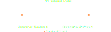
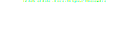
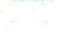

# Network and subnetwork

In the following sections, the different network components are described in terms of their main attributes and electrotechnical representation. The attributes shared by all the network components are described in the next table:

| Attribute    | Description                                                          |
|--------------|----------------------------------------------------------------------|
| $Id$         | Unique Id assigned to each network component                         |
| $Name$       | Human readable identifier (not necessary unique)                     |
| $Fictitious$ | To identify non-physical network components                          |
| $Aliases$    | Additional unique identifiers associated with each network component |
| $Properties$ | To add additional data items to network components                   |

All equipment and the network itself are identified by a unique identifier which is the only required attribute. They can have a human-readable name. Offers the possibility of adding additional unique identifiers to each component. An alias can be qualified to indicate what it corresponds to.

Properties allow associating additional arbitrary data items under the general schema of pairs `<Key, Value>`.

To identify non-physical network components, one can use the fictitious property that is set to `false` by default.

A network can contain several subnetworks.

(validation-level)=
## Validation level

The validation level can be set to `EQUIPMENT` or `STEADY_STATE_HYPOTHESIS`. A network at equipment level is a network with missing steady-state hypotheses. This occurs just after SCADA systems, before any state estimation. Once all steady-state hypotheses are filled, meaning that a load flow engine has all the data needed to perform a computation, the validation level switches to `STEADY_STATE_HYPOTHESIS`. For some processes, a minimal validation level of the network is required.

(network)=
## Network
[](https://javadoc.io/doc/com.powsybl/powsybl-core/latest/com/powsybl/iidm/network/Network.html)

In the PowSyBl grid model, the Network contains [substations](#substation), which themselves contain [voltage levels](#voltage-level).

**Characteristics**

| Attribute          | Description                                                             |
|--------------------|-------------------------------------------------------------------------|
| $SourceFormat$     | Source format of the imported network model                             |
| $CaseDate$         | Date and time of the target network that is being modeled               |
| $ForecastDistance$ | Number of minutes between the network generation date and the case date |

The `SourceFormat` attribute is a required attribute that indicates the origin of the network model automatically set by the [importers](../grid_exchange_formats/index.md). If the case date and the forecast distance cannot be found in the case file, the network is considered as a snapshot: the case date is set to the current date, and the forecast distance is set to `0`.

**Available extensions**

(substation)=
## Substation
[](https://javadoc.io/doc/com.powsybl/powsybl-core/latest/com/powsybl/iidm/network/Substation.html)

A substation represents a specific geographical location with equipment grouped in one or several [voltage levels](#voltage-level).

**Characteristics**

| Attribute          | Description                                                           |
|--------------------|-----------------------------------------------------------------------|
| $Country$          | To specify in which country the substation is located                 |
| $GeographicalTags$ | They make it possible to accurately locate the substation             |
| $TSO$              | To track to which Transmission System Operator the substation belongs |

All three attributes are optional.

**Available extensions**
- [ENTSO-E Area](extensions.md#entso-e-area)

(voltage-level)=
## Voltage level
[](https://javadoc.io/doc/com.powsybl/powsybl-core/latest/com/powsybl/iidm/network/VoltageLevel.html)

A voltage level contains equipment with the same nominal voltage. Two voltage levels may be connected through lines (when they belong to different substations) or through transformers (they must be located within the same substation).

**Characteristics**

| Attribute          | Unit | Description                  |
|--------------------|------|------------------------------|
| $NominalVoltage$   | kV   | Nominal base voltage         |
| $LowVoltageLimit$  | kV   | Low voltage limit magnitude  |
| $HighVoltageLimit$ | kV   | High voltage limit magnitude |
| $TopologyKind$     |      | Level of connectivity detail |

**Specifications**

Only `NominalVoltage` and `TopologyKind` are required.

The connectivity in each voltage level of the network can be defined at one of two levels: `node/breaker` or `bus/breaker`. The connectivity level can be different in each voltage level of the model.

In `node/breaker` the connectivity is described with the finest level of detail and can provide an exact field representation. This level could be described as a graph structure where the vertices are `Nodes` and the edges are `Switches` (breakers, disconnectors) or internal connections. Each equipment is associated to one `Node` (busbar sections, loads, generators, ..), two `Nodes` (transmission lines, two-winding transformers, ...) or three `Nodes` (three-winding transformers). Each `Node` can only have one associated equipment. `Nodes` do not have an alphanumeric `Id` or `Name`, they are identified by an integer.

Using `bus/breaker` the voltage level connectivity is described with a coarser level of detail. In this case the vertices of the graph are `Buses`, defined explicitly by the user. A `Bus` has an `Id`, and may have a `Name`. Each equipment defines the bus or buses to which it is connected. `Switches` can be defined between buses.

PowSyBl provides an integrated topology processor that allows to automatically obtain a bus/breaker view from a node/breaker definition, and a bus/branch view from a bus/breaker view or definition. It builds the topology views from the open/close status of `Switches`. `Switches` marked as `retained` in the node/breaker level are preserved in the bus/breaker view.

The following diagram represents an example voltage level with two busbars separated by a circuit breaker, a transformer connected to one of them and three generators that can connect to any of the two busbars. The three topology levels are shown.

{width="100%" align=center class="only-light"}
{width="100%" align=center class="only-dark"}

When defining the model, the user has to specify how the different pieces of equipment connect to the network. If the voltage level is built at node/breaker level, the user has to specify a `Node` when adding equipment to the model. If the user is building using bus/breaker level, the `Bus` of the equipment must be specified. Using this information, the model creates a `Terminal` that will be used to manage the point of connection of the equipment to the network.

**Available extensions**

- [Discrete Measurements](extensions.md#discrete-measurements)
- [Identifiable Short-Circuit](extensions.md#identifiable-short-circuit)
- [Slack Terminal](extensions.md#slack-terminal)

(area)=
## Area
[](https://javadoc.io/doc/com.powsybl/powsybl-core/latest/com/powsybl/iidm/network/Area.html)

An Area is a geographical zone of a given type.

An Area is composed of a collection of [voltage levels](#voltage-level), and a collection of area boundaries.
Area boundaries can be terminals of equipments or `Boundary` objects from [dangling lines](#dangling-line).

The area type is used to distinguish between various area concepts of different granularity. For instance: control areas, bidding zones, countries...

A [voltage level](#voltage-level) can belong to several areas, as long as all areas are of a different type.

The area boundaries define how interchange is to be calculated for the area.  
Area interchange is calculated by summing the active power flows across the area boundaries and can be obtained for AC part only (considering only AC boundaries),
for DC part only (considering only DC boundaries) and in total (AC+DC).  
Note that if the Area has no boundary explicitly defined, the interchange is considered 0MW.

For area types that are meant to be used for area interchange control, e.g., in Load Flow simulations, the interchange target of the area can be specified as an input for the simulation.

All area interchange values use the load sign convention: positive values indicate that the area is importing, negative values that the area is exporting.

**Characteristics of an Area**

| Attribute           | Unit | Description                                                    |
|---------------------|------|----------------------------------------------------------------|
| $AreaType$          |      | To specify the type of Area (eg. ControlArea, BiddingZone ...) |
| $interchangeTarget$ | MW   | Target active power interchange                                |
| $VoltageLevels$     |      | List of voltage levels of the area                             |
| $AreaBoundaries$    |      | List of area boundaries of the area                            |

**Characteristics of an AreaBoundary**

An area boundary is modeled by an `AreaBoundary` instance.
It is composed of either DanglingLine Boundary or a Terminal, and boolean telling if the area boundary
is to be considered as AC or DC.

The `Ac` flag is informative and is present to support the use case where boundaries are defined on AC components even though
the boundary is related to an HVDC link. An example for this is a DanglingLine (which is an AC equipment) that may actually represent
an HVDC interconnection that is not explicitly described in the network model. This information is used when computing area interchanges,
which are then separated for AC and DC parts.

| Attribute  | Unit | Description                                                                 |
|------------|------|-----------------------------------------------------------------------------|
| $Area$     |      | The area of this boundary                                                   |
| $Boundary$ |      | Boundary of a DanglingLine (mutually exclusive with the Terminal attribute) |
| $Terminal$ |      | Terminal of an equipment (mutually exclusive with the Boundary attribute)   |
| $Ac$       |      | True if AreaBoundary is to be considered AC, false otherwise                |

(generator)=
## Generator
[](https://javadoc.io/doc/com.powsybl/powsybl-core/latest/com/powsybl/iidm/network/Generator.html)

A generator is a piece of equipment that injects or consumes active power, and injects or consumes reactive power. It may be used as a controller to hold a voltage or reactive target somewhere in the network, not necessarily directly where it is connected. In that specific case, the voltage or reactive power control is remote.

{width="50%" align=center class="only-light"}
{width="50%" align=center class="only-dark"}

**Characteristics**

| Attribute            | Unit | Description                                                 |
|----------------------|------|-------------------------------------------------------------|
| $MinP$               | MW   | Minimum generator active power output                       |
| $MaxP$               | MW   | Maximum generator active power output                       |
| $ReactiveLimits$     | MVar | Operational limits of the generator (P/Q/V diagram)         |
| $RatedS$             | MVA  | The rated nominal power                                     |
| $TargetP$            | MW   | The active power target                                     |
| $TargetQ$            | MVAr | The reactive power target at local terminal                 |
| $TargetV$            | kV   | The voltage target at regulating terminal                   |
| $RegulatingTerminal$ |      | Associated node or bus for which voltage is to be regulated |
| $VoltageRegulatorOn$ |      | True if the generator regulates voltage                     |
| $EnergySource$       |      | The energy source harnessed to turn the generator           |
| $IsCondenser$        |      | True if the generator may behave as a condenser             |

**Specifications**

The values `MinP`, `MaxP` and `TargetP` are required. The minimum active power output cannot be greater than the maximum active power output. `TargetP` must be inside this active power limits. `RatedS` specifies the nameplate apparent power rating for the unit, it is optional and should be a positive value if it is defined. The [reactive limits](./additional.md#reactive-limits) of the generator are optional, if they are not given the generator is considered with unlimited reactive power. Reactive limits can be given as a pair of [min/max values](./additional.md#min-max-reactive-limits) or as a [reactive capability curve](./additional.md#reactive-capability-curve).

The `VoltageRegulatorOn` attribute is required. It voltage regulation is enabled, then `TargetV` and `RegulatingTerminal` must also be defined. If the voltage regulation is disabled, then `TargetQ` is required. `EnergySource` is optional, it can be: `HYDRO`, `NUCLEAR`, `WIND`, `THERMAL`, `SOLAR` or `OTHER`.

Target values for generators (`TargetP` and `TargetQ`) follow the generator sign convention: a positive value means an injection into the bus. Positive values for `TargetP` and `TargetQ` mean negative values at the flow observed at the generator `Terminal`, as `Terminal` flow always follows load sign convention. The following diagram shows the sign convention of these quantities with an example.

The `isCondenser` value corresponds for instance to generators which can control voltage even if their targetP is equal to zero.


**Available extensions**

- [Active Power Control](extensions.md#active-power-control)
- [Coordinated Reactive Control](extensions.md#coordinated-reactive-control)
- [Discrete Measurements](extensions.md#discrete-measurements)
- [Generator ENTSO-E Category](extensions.md#generator-entso-e-category)
- [Generator Short-Circuit](extensions.md#generator-short-circuit)
- [Injection Observability](extensions.md#injection-observability)
- [Measurements](extensions.md#measurements)
- [Remote Reactive Power Control](extensions.md#remote-reactive-power-control)

(load)=
## Load
[](https://javadoc.io/doc/com.powsybl/powsybl-core/latest/com/powsybl/iidm/network/Load.html)

A load is a passive equipment representing a delivery point that consumes or produces active and reactive power.

**Characteristics**

| Attribute | Unit | Description                 |
|-----------|------|-----------------------------|
| $P0$      | MW   | The active power setpoint   |
| $Q0$      | MVar | The reactive power setpoint |

**Specifications**

- Initial values for loads P0 and Q0 follow the passive-sign convention:
    - Flow out from the bus has a positive sign.
    - Consumptions are positive.

**Metadata**
In the grid model, loads comprise the following metadata:
- The load type, which can be:
    - `UNDEFINED`
    - `AUXILIARY`
    - `FICTITIOUS`
- The load model, which can be:
    - `ZIP` (or polynomial), following equations:
  
      $$P = P0 * (c0p + c1p \times (v / v_0) + c2p \times (v / v_0)^2)$$  

      $$Q = Q0 * (c0q + c1q \times (v / v_0) + c2q \times (v / v_0)^2)$$  

      with $v_0$ the nominal voltage.  
      Sum of $c0p$, $c1p$ and $c2p$ must be equal to 1.  
      Sum of $c0q$, $c1q$ and $c2q$ must be equal to 1.
    - `EXPONENTIAL`, following equations:  

      $$P = P0 \times (v / v_0)^{n_p}$$  

      $$Q = Q0 \times (v / v_0)^{n_q}$$  

      with $v_0$ the nominal voltage.  
      $n_p$ and $n_q$ are expected to be positive.

**Available extensions**

- [Connectable position](extensions.md#connectable-position)
- [Discrete Measurements](extensions.md#discrete-measurements)
- [Identifiable Short-Circuit](extensions.md#identifiable-short-circuit)
- [Injection Observability](extensions.md#injection-observability)
- [Load Asymmetrical](extensions.md#load-asymmetrical)
- [Load Detail](extensions.md#load-detail)
- [Measurements](extensions.md#measurements)

(battery)=
## Battery
[](https://javadoc.io/doc/com.powsybl/powsybl-core/latest/com/powsybl/iidm/network/Battery.html)

A battery on the electric grid is an energy storage device that is either capable of capturing energy from the grid or
of injecting it into the grid. The electric energy on the grid side is thus transformed into chemical energy on the
battery side and vice versa. The power flow is bidirectional, and it is controlled via a power electronic converter.

**Characteristics**

| Attribute        | Unit | Description                                       |
|------------------|------|---------------------------------------------------|
| $TargetP$        | MW   | The active power target                           |
| $TargetQ$        | MVar | The reactive power target                         |
| $MinP$           | MW   | The Minimal active power (charging limit)         |
| $MaxP$           | MW   | The Maximum active power (discharging limit)      |
| $ReactiveLimits$ | MVar | Operational limits of the battery (P/Q/V diagram) |

The values `TargetP`, `TargetQ`, `MinP`, `MaxP`, are required.

All attributes follow the generator sign convention: a positive value means an injection into the bus.
Positive values for `TargetP` and `TargetQ` mean negative values at the flow observed at the battery `Terminal`,
as `Terminal` flow always follows load sign convention.

The minimum active power output `MinP` cannot be greater than the maximum active power output `MaxP`.
`MinP` represents the battery charging active power limit, and is typically negative.
`MaxP` represents discharge active power limit, and is typically positive.

The [reactive limits](./additional.md#reactive-limits) of the battery are optional, if they are not given the battery
is considered with unlimited reactive power. Reactive limits can be given as a pair of [min/max values](./additional.md#min-max-reactive-limits) or as
a [reactive capability curve](./additional.md#reactive-capability-curve).

**Available extensions**

- [Active Power Control](extensions.md#active-power-control)
- [Connectable position](extensions.md#connectable-position)
- [Discrete Measurements](extensions.md#discrete-measurements)
- [Identifiable Short-Circuit](extensions.md#identifiable-short-circuit)
- [Injection Observability](extensions.md#injection-observability)
- [Measurements](extensions.md#measurements)

(dangling-line)=
## Dangling line
[](https://javadoc.io/doc/com.powsybl/powsybl-core/latest/com/powsybl/iidm/network/DanglingLine.html)

A network may be connected to other networks for which a full description is not available or unwanted. In this case, a boundary line exists between the two networks. In the network of interest, that connection could be represented through a dangling line, which represents the part of that boundary line which is located in it. A dangling line is thus a passive or active component that aggregates a line chunk and a constant power injection in passive-sign convention. The active and reactive power set points are fixed: the injection represents the power flow that would occur through the connection, were the other network fully described.

{width="50%" align=center class="only-light"}
{width="50%" align=center class="only-dark"}

A generation part, at boundary side can also be modeled with a constant active power injection and a constant reactive power injection if the generation part of the dangling line is out of voltage regulation or a voltage target if the regulation is enabled. This fictitious generator can only regulate voltage locally: the regulating terminal cannot be set, it is necessary for the boundary side of the dangling line. Limits are modeled through $MinP$ and $MaxP$ for active power limits and through [reactive limits](./additional.md#reactive-limits). This generation part is optional. The generation part of the dangling line follows the classical generator sign convention.

Resulting flows at the dangling line terminal all follow the same passive-sign convention, either for the injection part or for the generation part.

Dangling lines are key objects for merging networks. Merging will be described soon [here](TODO).

**Characteristics**

| Attribute | Unit     | Description                 |
|-----------|----------|-----------------------------|
| $P0$      | MW       | The active power setpoint   |
| $Q0$      | MVar     | The reactive power setpoint |
| $R$       | $\Omega$ | The series resistance       |
| $X$       | $\Omega$ | The series reactance        |
| $G$       | S        | The shunt conductance       |
| $B$       | S        | The shunt susceptance       |

Optional:

| Attribute            | Unit | Description                                               |
|----------------------|------|-----------------------------------------------------------|
| $MinP$               | MW   | Minimum generation part active power output               |
| $MaxP$               | MW   | Maximum generation part active power output               |
| $ReactiveLimits$     | MVar | Operational limits of the generation part (P/Q/V diagram) |
| $TargetP$            | MW   | The active power target                                   |
| $TargetQ$            | MVAr | The reactive power target                                 |
| $TargetV$            | kV   | The voltage target                                        |
| $VoltageRegulatorOn$ |      | True if the generation part regulates voltage             |

**Specifications**

- $P0$ and $Q0$ are the active and reactive power setpoints
- $R$, $X$, $G$ and $B$ correspond to a fraction of the original line and have to be consistent with the declared length of the
  dangling line.

In case the line is a boundary, a pairing key $pairingKey$ (in previous network versions $UcteXnodeCode$) is defined beside the characteristics of the table. It is a key to match two dangling lines and reconstruct the full boundary line for both UCTE or CIM-CGMES formats.

A dangling line has a `Boundary` object that emulates a terminal located at boundary side. A dangling line is a connectable
with a single terminal located on the network side, but sometimes we need state variables such as active or reactive powers on
the other side, voltage angle and voltage magnitude at fictitious boundary bus. Note that $P$, $Q$, $V$ and $Angle$ at boundary
are automatically computed using information from the terminal of the dangling line.  


**Available extensions**

- [CGMES Dangling Line Boundary Node](../grid_exchange_formats/cgmes/import.md#cgmes-dangling-line-boundary-node)
- [Connectable position](extensions.md#connectable-position)
- [Discrete Measurements](extensions.md#discrete-measurements)
- [Identifiable Short-Circuit](extensions.md#identifiable-short-circuit)
- [Injection Observability](extensions.md#injection-observability)
- [Measurements](extensions.md#measurements)

(shunt-compensator)=
## Shunt compensator
[](https://javadoc.io/doc/com.powsybl/powsybl-core/latest/com/powsybl/iidm/network/ShuntCompensator.html)

A shunt compensator represents a shunt capacitor or reactor or a set of switchable banks of shunt capacitors or reactors in the network. A section of a shunt compensator
is an individual capacitor or reactor: if its reactive power (Q) is negative, it is a capacitor; if it is positive, it is a reactor.

There are two supported models of shunt compensators: linear shunt compensators and non-linear shunt compensators.

A linear shunt compensator has banks or sections with equal admittance values.
A non-linear shunt compensator has banks or sections with different admittance values.

Shunt compensators follow a passive-sign convention:
- Flow out from bus has positive sign.
- Consumptions are positive.

**Characteristics**

| Attribute             | Unit | Description                                                   |
|-----------------------|------|---------------------------------------------------------------|
| $MaximumSectionCount$ | -    | The maximum number of sections that may be switched on        |
| $SectionCount$        | -    | The current number of sections that are switched on           |
| $B$                   | S    | The susceptance of the shunt compensator in its current state |
| $G$                   | S    | The conductance of the shunt compensator in its current state |
| $TargetV$             | kV   | The voltage target                                            |
| $TargetDeadband$      | kV   | The deadband used to avoid excessive update of controls       |
| $RegulatingTerminal$  | -    | Associated node or bus for which voltage is to be regulated   |
| $VoltageRegulatorOn$  | -    | True if the shunt compensator regulates voltage               |

- For Linear Shunt Compensators

| Attribute     | Unit | Description                                                    |
|---------------|------|----------------------------------------------------------------|
| $bPerSection$ | S    | The Positive sequence shunt (charging) susceptance per section |
| $gPerSection$ | S    | The Positive sequence shunt (charging) conductance per section |

We expect $bPerSection$ to be a non-zero value. The disconnected status of the linear shunt compensator can be modeled by setting the $SectionCount$ attribute to zero.

- For Non-Linear Shunt Compensators

| Attribute  | Unit                | Description                                           |
|------------|---------------------|-------------------------------------------------------|
| $Sections$ | [Section](#section) | The Partition of all the shunt compensator's sections |

### Section

| Attribute | Unit | Description                                                                                                                           |
|-----------|------|---------------------------------------------------------------------------------------------------------------------------------------|
| $B$       | S    | The accumulated positive sequence shunt (charging) susceptance of the section if this section and all the previous ones are activated |
| $G$       | S    | The accumulated positive sequence shunt (charging) conductance of the section if this section and all the previous ones are activated |

$B$ and $G$ attributes can be equal zero, but the disconnected status of the non-linear shunt compensator can be modeled by setting the $SectionCount$ attribute to zero. The section which $SectionCount$ equal to $1$ is the first effective section, and it would be more efficient to affect it a non-zero susceptance.

**Specifications**

- A section of a shunt compensator is an individual capacitor or reactor.
  A positive value of bPerSection means that it models a capacitor, a device that injects reactive
  power into the bus.
  A negative value of bPerSection means a reactor, a device that can absorb excess reactive power
  from the network.
- The current section count is expected to be greater than one and lesser or equal to the maximum section count.
- Regulation for shunt compensators does not necessarily model automation, it can represent human actions on the network
  e.g. an operator activating or deactivating a shunt compensator). However, it can be integrated on a power flow
  calculation or not, depending on what is wanted to be shown.
- In the case of a capacitor, the value for its Q will be negative.
- In the case of a reactor, the value for its Q will be positive.

**Available extensions**

- [Connectable position](extensions.md#connectable-position)
- [Discrete Measurements](extensions.md#discrete-measurements)
- [Identifiable Short-Circuit](extensions.md#identifiable-short-circuit)
- [Injection Observability](extensions.md#injection-observability)
- [Measurements](extensions.md#measurements)

(static-var-compensator)=
## Static VAR compensator
[](https://javadoc.io/doc/com.powsybl/powsybl-core/latest/com/powsybl/iidm/network/StaticVarCompensator.html)

It may be controlled to hold a voltage or reactive setpoint somewhere in the network (not necessarily directly where it is connected).
Static VAR compensators follow a passive-sign convention:
- Flow out from bus has positive sign.
- Consumptions are positive.

**Characteristics**

| Attribute               | Unit | Description                 |
|-------------------------|------|-----------------------------|
| $Bmin$                  | S    | The minimum susceptance     |
| $Bmax$                  | S    | The maximum susceptance     |
| $VoltageSetpoint$       | kV   | The voltage setpoint        |
| $ReactivePowerSetpoint$ | MVar | The reactive power setpoint |

**Specifications**

- $Bmin$ and $Bmax$ are the susceptance bounds of the static VAR compensator. Reactive power output of a static VAR compensator is limited by the maximum and the minimum susceptance values. The min/max reactive power of a static VAR compensator is determined by:  
  
  $$Qmin = -Bmin \times V^2$$

  $$Qmax = -Bmax \times V^2$$

  where $V$ is the voltage of the bus that connects the static VAR compensator to the network. Even if the regulating terminal is remote, only the local voltage has to be considered to retrieve the minimum and the maximum amount of reactive power. Reactive limits can be handled in an approximate way using the nominal voltage of the connected bus.
- The voltage setpoint is required when the regulation mode is set to `VOLTAGE`.
- The reactive power setpoint is required when the regulation mode is set to `REACTIVE_POWER`.

**Metadata**
In IIDM the static VAR compensator also comprises some metadata:

- The regulation mode, which can be:
    - `VOLTAGE`
    - `REACTIVE_POWER`
    - `OFF`  
      Note that it is different from the generator regulation definition, which is only done through a boolean. `OFF` is equivalent to a disconnected element.
- The regulating terminal, which can be local or remote: it is the specific connection point on the network where the setpoint is measured.

**Available extensions**

- [Connectable position](extensions.md#connectable-position)
- [Discrete Measurements](extensions.md#discrete-measurements)
- [Identifiable Short-Circuit](extensions.md#identifiable-short-circuit)
- [Injection Observability](extensions.md#injection-observability)
- [Measurements](extensions.md#measurements)
- [VoltagePerReactivePowerControl](extensions.md#voltage-per-reactive-power-control)

(line)=
## Line
[](https://javadoc.io/doc/com.powsybl/powsybl-core/latest/com/powsybl/iidm/network/Line.html)

AC transmission lines are modeled using a standard $\pi$ model with distributed parameters. A `Line` is a `Branch`, that models equipment with two terminals (or two sides). For the time being, a branch is an AC equipment.

{width="50%" align=center class="only-light"}
{width="50%" align=center class="only-dark"}

With series impedance $z$ and the shunt admittance on each side $y_1$ and $y_2$:

$$
\begin{align*}
\begin{array}{lcl}
z & = & r+j.x\\
y_1 & = & g_1 +j. b_1\\
y_2 & = & g_2 +j. b_2
\end{array}
\end{align*}
$$

The equations of the line, in complex notations, are as follows:

$$
\begin{align*}
& \left(\begin{array}{c}
I_{1}\\
I_{2}
\end{array}\right)=\left(\begin{array}{cc}
y_{1}+\dfrac{1}{z} & -\dfrac{1}{z}\\
-\dfrac{1}{z} & y_{2}+\dfrac{1}{z}
\end{array}\right)\left(\begin{array}{c}
V_{1}\\
V_{2}
\end{array}\right)
\end{align*}
$$

**Characteristics**

| Attribute | Unit     | Description                       |
|-----------|----------|-----------------------------------|
| $R$       | $\Omega$ | The series resistance             |
| $X$       | $\Omega$ | The series reactance              |
| $G1$      | S        | The first side shunt conductance  |
| $B1$      | S        | The first side shunt susceptance  |
| $G2$      | S        | The second side shunt conductance |
| $B2$      | S        | The second side shunt susceptance |

**Metadata**

- Lines can have [loading limits](./additional.md#loading-limits).

**Available extensions**

- [Connectable position](extensions.md#connectable-position)
- [Branch Observability](extensions.md#branch-observability)
- [Operating Status](extensions.md#operating-status)
- [CGMES Line Boundary Node](../grid_exchange_formats/cgmes/import.md#cgmes-line-boundary-node)
- [Discrete Measurements](extensions.md#discrete-measurements)
- [Identifiable Short-Circuit](extensions.md#identifiable-short-circuit)
- [Measurements](extensions.md#measurements)

(tie-line)=
## Tie line
[](https://javadoc.io/doc/com.powsybl/powsybl-core/latest/com/powsybl/iidm/network/TieLine.html)

A tie line is an AC line sharing power between two neighbouring regional grids.
It is created by pairing two [dangling lines](#dangling-line) with the same pairing key.
It has line characteristics, with $R$ (resp. $X$) being the sum of the series resistances (resp. reactances) of the two dangling lines.
$G1$ (resp. $B1$) is equal to the first dangling line's $G1$ (resp. $B1$).
$G2$ (resp. $B2$) is equal to the second dangling line's $G2$ (resp. $B2$).

**Characteristics**

| Attribute | Unit     | Description                       |
|-----------|----------|-----------------------------------|
| $R$       | $\Omega$ | The series resistance             |
| $X$       | $\Omega$ | The series reactance              |
| $G1$      | S        | The first side shunt conductance  |
| $B1$      | S        | The first side shunt susceptance  |
| $G2$      | S        | The second side shunt conductance |
| $B2$      | S        | The second side shunt susceptance |

A tie line is not a connectable. It is just a container of two underlying dangling lines with the same pairing key. When connected together, each dangling line `P0` and `Q0` (and generation part if present) is ignored: only global tie line characteristics are used to compute flow. Removing a tie line leads to two free dangling lines, with an optional update of `P0` and `Q0` to match the flows in the global network context.

## Transformers

(two-winding-transformer)=
### Two-winding transformer
[](https://javadoc.io/doc/com.powsybl/powsybl-core/latest/com/powsybl/iidm/network/TwoWindingsTransformer.html)

A two-winding power transformer is connected to two voltage levels (side 1 and side 2) that belong to the same substation.
Two winding transformers are modeled with the following equivalent $\Pi$ model:

{width="50%" align=center class="only-light"}
{width="50%" align=center class="only-dark"}

With the series impedance $z$ and the shunt admittance $y$ and the voltage ratio $\rho$ and the angle difference $\alpha$ and potential parameters from the current step of a [ratio tap changer](./additional.md#ratio-tap-changer) and/or a [phase tap changer](./additional.md#phase-tap-changer), we have:

$$
\begin{array}{lcl}
r & = & r_{nom}.\left(1+\dfrac{r_{r, tap} + r_{\phi, tap}}{100}\right)\\
x & = & x_{nom}.\left(1+\dfrac{x_{r, tap} + x_{\phi, tap}}{100}\right)\\
g & = & g_{nom}.\left(1+\dfrac{g_{r, tap} + g_{\phi, tap}}{100}\right)\\
b & = & b_{nom}.\left(1+\dfrac{b_{r, tap} + b_{\phi, tap}}{100}\right)\\
\rho & = & \dfrac{V_{2nom}}{V_{1nom}}.\rho_{r, tap}.\rho_{\phi, tap}\\
\alpha & = & \alpha_{\phi, tap}\\
z & = & r + j.x\\
y & = & g + j.b\\
V_{0} & = & V_{1}.\rho e^{j\alpha}\\
I_{0} & = & \dfrac{I_{1}}{\rho e^{-j\alpha}}\\
\end{array}
$$

Using the above notation, the equations of the two-winding transformers, in complex notations, are as follows:

$$
\left(\begin{array}{c}
I_{1}\\
I_{2}
\end{array}\right)=\left(\begin{array}{cc}
\rho\text{²}(y+\dfrac{1}{z}) & -\dfrac{1}{z}\rho e^{-j\alpha}\\
-\rho\dfrac{1}{z} e^{j\alpha} & \dfrac{1}{z}
\end{array}\right)\left(\begin{array}{c}
V_{1}\\
V_{2}
\end{array}\right)
$$

**Characteristics**

| Attribute    | Unit     | Description                                                          |
|--------------|----------|----------------------------------------------------------------------|
| $R_{nom}$    | $\Omega$ | The nominal series resistance at the side 2 of the transformer       |
| $X_{nom}$    | $\Omega$ | The nominal series reactance at the side 2 of the transformer        |
| $G_{nom}$    | S        | The nominal magnetizing conductance at the side 2 of the transformer |
| $B_{nom}$    | S        | The nominal magnetizing susceptance at the side 2 of the transformer |
| $V_{1\ nom}$ | kV       | The rated voltage at side 1                                          |
| $V_{2\ nom}$ | kV       | The rated voltage at side 2                                          |
| $RatedS$     | MVA      | The normal apparent power                                            |

**Specifications**

- A [ratio tap changer](./additional.md#ratio-tap-changer) and/or a [phase tap changer](./additional.md#phase-tap-changer) can be associated with a two-winding power transformer.
- For a two-winding transformer, the normal apparent power shall be identical at both sides 1 and 2.

**Available extensions**

- [Branch Observability](extensions.md#branch-observability)
- [Operating Status](extensions.md#operating-status)
- [Connectable position](extensions.md#connectable-position)
- [Discrete Measurements](extensions.md#discrete-measurements)
- [Identifiable Short-Circuit](extensions.md#identifiable-short-circuit)
- [Measurements](extensions.md#measurements)
- [Two-windings Transformer Phase Angle Clock](extensions.md#two-winding-transformer-phase-angle-clock)
- [Two-windings Transformer To Be Estimated](extensions.md#two-winding-transformer-to-be-estimated)

(three-winding-transformer)=
### Three-winding transformer
[](https://javadoc.io/doc/com.powsybl/powsybl-core/latest/com/powsybl/iidm/network/ThreeWindingsTransformer.html)

A three-winding power transformer is connected to three voltage levels (side 1, side 2 and side 3) that belong to the
same substation. We usually have:
- Side 1 as the primary side (side with the highest rated voltage)
- Side 2 as the secondary side (side with the medium rated voltage)
- Side 3 as the tertiary side (side with the lowest rated voltage)

A three-winding transformer is modeled with three legs, where every leg model is electrically equivalent to a two-winding transformer.
For each leg, the network bus is at side 1 and the star bus is at side 2.

{width="50%" align=center class="only-light"}
{width="50%" align=center class="only-dark"}

**Characteristics**

| Attribute | Unit | Description                       |
|-----------|------|-----------------------------------|
| $RatedU0$ | kV   | The rated voltage at the star bus |

**Specifications**

- A [ratio tap changer](./additional.md#ratio-tap-changer) and/or a [phase tap changer](./additional.md#phase-tap-changer) can be associated to all three sides of a three-winding power transformer.
  Only one tap changer (either ratio or phase tap changer) is allowed to be regulating on the equipment at a given time.

**Available extensions**

- [Operating Status](extensions.md#operating-status)
- [Connectable position](extensions.md#connectable-position)
- [Discrete Measurements](extensions.md#discrete-measurements)
- [Identifiable Short-Circuit](extensions.md#identifiable-short-circuit)
- [Measurements](extensions.md#measurements)
- [Three-windings Transformer Phase Angle Clock](extensions.md#three-winding-transformer-phase-angle-clock)
- [Three-windings Transformer To Be Estimated](extensions.md#three-winding-transformer-to-be-estimated)

#### Three-winding transformer leg

**Characteristics**

| Attribute | Unit     | Description                                                             |
|-----------|----------|-------------------------------------------------------------------------|
| $R$       | $\Omega$ | The nominal series resistance specified at the voltage of the leg       |
| $X$       | $\Omega$ | The nominal series reactance specified at the voltage of the leg        |
| $G$       | S        | The nominal magnetizing conductance specified at the voltage of the leg |
| $B$       | S        | The nominal magnetizing susceptance specified at the voltage of the leg |
| $RatedU$  | kV       | The rated voltage                                                       |
| $RatedS$  | MVA      | The normal apparent power                                               |

**Specifications**

- A leg can have [loading limits](./additional.md#loading-limits).

## DC Equipments

### Reduced vs. Detailed DC Models

Direct Current (DC) equipment can be modeled in two distinct ways: using a **_reduced_** model or a **_detailed_** model.

The **_reduced_** model abstracts away internal DC components.
A DC link is represented as a single DC line rigidly connected to two AC/DC converters.
In this representation, each converter connects to the AC network through a single connection.

{width="100%" align=center class="only-light"}
{width="100%" align=center class="only-dark"}

In contrast, the **_detailed_** model includes a broader set of DC components, such as DC nodes, DC grounds, DC switches, DC lines, and AC/DC converters.
This approach enables a more accurate representation of the wide range of HVDC configurations.
It allows modeling of features such as:
- Metallic return cables, bipole systems, symmetrical and asymmetrical configurations, bypass DC switches, multi-terminal DC grids (radial or meshed)
- AC/DC converters with dual connections to the AC network (e.g., for the two transformers connections of a 12-pulse converter)

{width="100%" align=center class="only-light"}
{width="100%" align=center class="only-dark"}

{width="100%" align=center class="only-light"}
{width="100%" align=center class="only-dark"}

{width="100%" align=center class="only-light"}
{width="100%" align=center class="only-dark"}

The same network may contain multiple HVDC links with either representation.

Both the _reduced_ and _detailed_ models support the representation of Line-Commutated Converters (LCCs)
and Voltage Source Converters (VSCs).

Further details on these two modeling approaches are provided in the following sections.

### Reduced DC model

(hvdc-line)=
#### HVDC line
[](https://javadoc.io/doc/com.powsybl/powsybl-core/latest/com/powsybl/iidm/network/HvdcLine.html)

An HVDC line is connected to the DC side of two HVDC converter stations, either an [LCC station](#lcc-converter-station) or a [VSC station](#vsc-converter-station).

**Characteristics**

| Attribute             | Unit     | Description                     |
|-----------------------|----------|---------------------------------|
| $R$                   | $\Omega$ | The resistance of the HVDC line |
| $NominalV$            | kV       | The nominal voltage             |
| $ActivePowerSetpoint$ | MW       | The active power setpoint       |
| $MaxP$                | MW       | The maximum active power        |

**Specifications**

- The HVDC line operation depends on a converter mode, which indicates the flow direction. In the specification it is thus mandatory to define `ConvertersMode`, which can be:
    - `SIDE_1_RECTIFIER_SIDE_2_INVERTER`: the flow goes from side 1 to side 2
    - `SIDE_1_INVERTER_SIDE_2_RECTIFIER`: the flow goes from side 2 to side 1

  The flow sign is thus given by the type of the converter station: the power always flows from the rectifier converter station to the inverter converter station.
  At a terminal on the AC side, `P` and `Q` follow the passive sign convention. `P` is positive on the rectifier side. `P` is negative at the inverter side.
- The active power setpoint and the maximum active power should always be positive values.

**Available extensions**

- [HVDC Angle Droop Active Power Control](extensions.md#hvdc-angle-droop-active-power-control)
- [HVDC Operator Active Power Range](extensions.md#hvdc-operator-active-power-range)

(hvdc-converter-station)=
#### HVDC converter station

An HVDC converter station converts electric power from high voltage alternating current (AC) to high-voltage direct current (HVDC), or vice versa.
Electronic converters for HVDC are divided into two main categories: line-commutated converters (LCC) and voltage-sourced converters (VSC).

**Characteristics**

| Attribute  | Type       | Unit | Required | Default value | Description     |
|------------|------------|------|----------|---------------|-----------------|
| HvdcType   | `HvdcType` | -    | yes      | -             | The HVDC type   |
| LossFactor | float      | %    | yes      | -             | The loss factor |

The LossFactor should be greater than 0.

**Specifications**

The HVDC type, `LCC` or `VSC`, determines if the Converter Station is an LCC Converter Station or a VSC Converter Station.

The positive loss factor `LossFactor` is used to model the losses during the conversion. In case of:
- A rectifier operation (conversion from AC to DC), we have

  $$\frac{P_{DC}}{P_{AC}} = 1 - \frac{LossFactor}{100}$$

- An inverter operation (conversion from DC to AC), we have

  $$\frac{P_{AC}}{P_{DC}} = 1 - \frac{LossFactor}{100}$$

  Note that at the terminal on the AC side, $Q$ is always positive: the converter station always consumes reactive power.

(lcc-converter-station)=
##### LCC converter station
[](https://javadoc.io/doc/com.powsybl/powsybl-core/latest/com/powsybl/iidm/network/LccConverterStation.html)

An LCC converter station is made with electronic switches that can only be turned on (thyristors). Below are some characteristics:
- Use semiconductors which can withstand voltage in either polarity
- Output voltage can be either polarity to change the power direction
- Current direction does not change
- Store energy inductively
- Use semiconductors which can turn on by control action
- Turn-off and commutation rely on the external circuit

**Characteristics**

| Attribute     | Unit | Description                                                    |
|---------------|------|----------------------------------------------------------------|
| $PowerFactor$ | %    | Ratio between the active power $P$ and the apparent power $S$. |

**Available extensions**

- [Connectable position](extensions.md#connectable-position)

(vsc-converter-station)=
##### VSC converter station
[](https://javadoc.io/doc/com.powsybl/powsybl-core/latest/com/powsybl/iidm/network/VscConverterStation.html)

A VSC converter station is made with switching devices that can be turned both on and off (transistors). Below are some characteristics:
- Use semiconductors which can pass current in either direction
- Output voltage polarity does not change
- Current direction changes to change the power direction
- Store energy capacitively
- Use semiconductors which can turn on or off by control action
- Turn-off is independent of external circuit

**Characteristics**

| Attribute               | Unit | Description                                |
|-------------------------|------|--------------------------------------------|
| $VoltageSetpoint$       | kV   | The voltage setpoint for regulation        |
| $ReactivePowerSetpoint$ | MVar | The reactive power setpoint for regulation |

**Specifications**

- The voltage setpoint (in kV) is required if the voltage regulator is on for the VSC station.
- The reactive power setpoint (in MVar) is required if the voltage regulator is off for the VSC station. A positive value of $ReactivePowerSetpoint$ means an injection into the bus, thus a negative value at the corresponding terminal (which is in passive-sign convention).
- A set of reactive limits can be associated to a VSC converter station. All the reactive limits modeling available in the library are described [here](./additional.md#reactive-limits).

**Metadata**
- The participation in regulation (through a boolean)

**Available extensions**

- [Connectable position](extensions.md#connectable-position)

### Detailed DC model (beta)

```{warning}
**The detailed DC model was introduced in iIDM v1.14 and is currently in beta.**

Future releases will enhance this model with support for DC topology processing and serialization/deserialization.  
These improvements will introduce **breaking changes** and **will not be backward compatible**.

Currently, this model is only available in the iIDM representation.
Support in exchange formats (CGMES, ...) as well as in downstream projects (e.g., `powsybl-diagram`, `powsybl-open-loadflow`, etc.) may vary.
Please consult the documentation of each project to verify support. In general, lack of explicit mention means no support.

If you’re unsure, feel free to reach out to the PowSyBl community [here](https://www.powsybl.org/pages/community/contact.html).
```

#### DC Node

[](https://javadoc.io/doc/com.powsybl/powsybl-core/latest/com/powsybl/iidm/network/DcNode.html)<br>
DC nodes are points where DC terminals of DC conducting equipment are connected together with zero impedance.

**Characteristics**

| Attribute  | Unit | Description                          |
|------------|------|--------------------------------------|
| $NominalV$ | kV   | The nominal voltage, always positive |

Although the nominal voltage of DC nodes must always be specified as a positive value,
the solved voltages can be negative - for example, in the case of an LCC monopole operating in reverse polarity.

#### DC Line

[](https://javadoc.io/doc/com.powsybl/powsybl-core/latest/com/powsybl/iidm/network/DcLine.html)<br>
A DC Line connects two DC Nodes with a series resistance.

A DC Line has two DC Terminals.

**Characteristics**

| Attribute | Unit     | Description                            |
|-----------|----------|----------------------------------------|
| $R$       | $\Omega$ | The series resistance, always positive |


#### DC Switch

[](https://javadoc.io/doc/com.powsybl/powsybl-core/latest/com/powsybl/iidm/network/DcSwitch.html)<br>
A DC Switch connects two DC Nodes and can be opened or closed.

**Characteristics**

| Attribute  | Unit           | Description                                                       |
|------------|----------------|-------------------------------------------------------------------|
| $Kind$     | `DcSwitchKind` | Either DISCONNECTOR or BREAKER                                    |
| $Open$     |                | True if the switch is opened                                      |

#### DC Ground

[](https://javadoc.io/doc/com.powsybl/powsybl-core/latest/com/powsybl/iidm/network/DcGround.html)<br>
DC Grounds represent grounding electrodes and are modeled as having zero voltage potential with a grounding resistance taken into account.

A DC Ground has a single DC Terminal.

**Characteristics**

| Attribute | Unit     | Description                               |
|-----------|----------|-------------------------------------------|
| $R$       | $\Omega$ | The grounding resistance, always positive |


#### AC/DC Converter

[](https://javadoc.io/doc/com.powsybl/powsybl-core/latest/com/powsybl/iidm/network/AcDcConverter.html)<br>

AC/DC Converter transfers power between AC and DC grids. Its connectivity is modeled with:
- either one or two AC Terminals,
- exactly two DC Terminals

AC/DC Converter can be either a Line Commutated Converter (LCC) or Voltage Source Converter (VSC).
LCC and VSC share the following characteristics.

**Characteristics**

| Attribute       | Unit     | Description                                                           |
|-----------------|----------|-----------------------------------------------------------------------|
| $IdleLoss$      | MW       | Losses at no load                                                     |
| $SwitchingLoss$ | MW / A   | Switching losses                                                      |
| $ResistiveLoss$ | $\Omega$ | Resistive losses                                                      |
| $PccTerminal$   |          | Point of common coupling (PCC) AC terminal                            |
| $ControlMode$   |          | The converter's control mode: P_PCC or V_DC                           |
| $TargetP$       | MW       | Active power target at point of common coupling, load sign convention |
| $TargetVdc$     | kV       | DC voltage target                                                     |

Converter losses are modeled using the `IdleLoss`, `SwitchingLoss` and `ResistiveLoss` parameters, all positive values.
With `i` being the DC current through the converter, the Converter losses are computed as follows:

$$ConverterLosses = IdleLoss + SwitchingLoss.|i| + ResistiveLoss.i²$$

The converter losses is the active power difference between the converter AC Terminal(s) and DC Terminals.

The Point of Common Coupling (PCC) Terminal defines where the AC/DC converter interfaces with the AC grid.
The control mode defines whether the converter:
- controls active power at Point of Common Coupling
- or, controls DC voltage at its DC terminals

When the `ControlMode` of the converter is set to `P_PCC`, the converter controls active power flow at the (AC) Point of common coupling terminal.
`TargetP` is the desired active power flow at PCC, in passive sign convention, i.e.:

- positive `TargetP` means power flows from AC to DC, the converter is sending AC power to the DC system
- negative `TargetP` means power flows from DC to AC, the converter is receiving DC power to the AC system

For LCC 12-pulse converters, the PCC terminal is typically located on the station side of the transformers (not on the converter side).
For VSC converters having a single AC Terminal, it is valid for the PCC Terminal to be the converter terminal itself.
Because the PCC Terminal is used by the converter to control active power flow, it must be a branch terminal (a line or a transformer).
However, it cannot be a Busbar Section Terminal since no active power happens on Busbar Sections.

{width="100%" align=center class="only-light"}
{width="100%" align=center class="only-dark"}

When the `ControlMode` of the converter is set to `V_DC`, the converter controls DC voltage at it's DC Terminals.
`TargetVdc` is the desired target DC voltage, and is the voltage difference between DC Node 1 and DC Node 2.
`TargetVdc` may be either positive or negative. Negative value may be used to model reverse polarity operation in case of LCCs.
No explicit attribute specifies whether the DC is a symmetrical or asymmetrical scheme.
The scheme symmetrical or asymmetrical is derived implicitly by either the presence or absence of a DC Ground connected to the DC system:
- If a DC Ground is connected, the configuration is asymmetrical, and the converter imposes the target voltage difference
between the converter DC Node 1 and the DC Node 2 to be equal to `TargetVdc` 
- If no DC Ground is present, the configuration is symmetrical, in this case the converter provides internally an implicit DC Ground and imposes:
  - `+TargetVdc / 2` at the converter DC Node 1
  - `-TargetVdc / 2` at the converter DC Node 2

##### Line Commutated Converter

[](https://javadoc.io/doc/com.powsybl/powsybl-core/latest/com/powsybl/iidm/network/LineCommutatedConverter.html)<br>

**Characteristics**

| Attribute       | Unit | Description                                                    |
|-----------------|------|----------------------------------------------------------------|
| $ReactiveModel$ |      | FIXED_POWER_FACTOR or CALCULATED_POWER_FACTOR                  |
| $PowerFactor$   | %    | Ratio between the active power $P$ and the apparent power $S$. |

Line Commutated Converters always consume reactive power, the `PowerFactor` attribute specifies how much
is consumed when the reactive model is set to `FIXED_POWER_FACTOR`. Typical characteristic for LCCs is $Q = 0.5 P$
hence a PowerFactor of 0.89443.

##### Voltage Source Converter

[](https://javadoc.io/doc/com.powsybl/powsybl-core/latest/com/powsybl/iidm/network/VoltageSourceConverter.html)<br>

**Characteristics**

| Attribute               | Unit | Description                                |
|-------------------------|------|--------------------------------------------|
| $VoltageRegulatorOn$    |      | True if the converter regulates voltage    |
| $VoltageSetpoint$       | kV   | The voltage setpoint for regulation        |
| $ReactivePowerSetpoint$ | MVar | The reactive power setpoint for regulation |

**Specifications**

- The terminal used for regulation is the Point of Common Coupling terminal, for both voltage and reactive power control modes.
- The voltage setpoint (in kV) is required if the voltage regulator is on for the converter.
- The reactive power setpoint (in MVar) is required if the voltage regulator is off for the converter. The setpoint is in passive sign convention: a positive value of $ReactivePowerSetpoint$ means withdrawal from the bus.
- A set of reactive limits can be associated to a VSC converter. All the reactive limits modeling available in the library are described [here](./additional.md#reactive-limits).

#### DC Equipment containment in main network and subnetworks

Modeling a DC link involves creating multiple objects in the model such as DC nodes, lines, converters, switches, grounds
which relate to each other. When creating DC equipment, associations can be made only within the same network, which can be
either the main network or the same subnetwork. For example, the following associations are rejected by the model:
- creating a DC line connecting a DC Node A in subnetwork A with DC Node B in subnetwork B
- creating a DC Ground in subnetwork A connecting a DC Node contained in subnetwork B
- creating an AC/DC converter in a voltage level in subnetwork A connecting to DC nodes contained in main network
- setting the Point of Common Coupling of an AC/DC converter in a voltage level in subnetwork A to be a line terminal in subnetwork B
- etc ...

For more details about working with subnetworks, see [Working with subnetworks](../grid_features/working_with_subnetworks.md).

(busbar-section)=
## Busbar section

[](https://javadoc.io/doc/com.powsybl/powsybl-core/latest/com/powsybl/iidm/network/BusbarSection.html)<br>
A busbar section is a non impedant element used in a node/breaker substation topology to connect equipment.

<!---
<span style="color:red"> TODO</span>
-->

**Available extensions**

- [Busbar Section Position](extensions.md#busbar-section-position)
- [Discrete Measurements](extensions.md#discrete-measurements)
- [Identifiable Short-Circuit](extensions.md#identifiable-short-circuit)
- [Injection Observability](extensions.md#injection-observability)
- [Measurements](extensions.md#measurements)

(switch)=
## Breaker/switch

[](https://javadoc.io/doc/com.powsybl/powsybl-core/latest/com/powsybl/iidm/network/Switch.html)<br>
A switch is a device designed to close or open one or more electric circuits. There are several types of switches:
- breakers are capable of breaking currents under abnormal operating conditions (e.g. short-circuit);
- load break switches are capable of breaking currents under normal operating conditions;
- and disconnectors can only make or break negligible current.

A switch has an attribute to say if it is open or closed.

**Available extensions**

- [Discrete Measurements](extensions.md#discrete-measurements)

(internal-connection)=
## Internal connection

[](https://javadoc.io/doc/com.powsybl/powsybl-core/latest/com/powsybl/iidm/network/VoltageLevel.NodeBreakerView.InternalConnection.html)<br>
An internal connection is a zero-impedance connection between two elements in a voltage level.

Contrary to the switch, the internal connection does not have any attribute to say of it is open or closed.

(overload-management-system)=
## Overload management systems

[](https://javadoc.io/doc/com.powsybl/powsybl-core/latest/com/powsybl/iidm/network/OverloadManagementSystem.html)<br>
An overload management system is an automation system that monitors current on a terminal, defined by an equipment and an optional side.
Based on the measured values, various strategies (referred as 'trippings' in the model) can be implemented to reduce the current.
In a given strategy, if the current exceeds a threshold, a switch can be opened or closed to resolve the violation.

The switch open or close operation could be modeled using a switch ID, an association of a branch ID and a side,
or an association of a three-windings transformer ID and a side.

**Overload management system Characteristics**

| Attribute | Unit | Description                                             |
| --------- | ---- |---------------------------------------------------------|
| $Substation$ | | The substation associated where the system is installed |
| $MonitoredElementId$ | | The network element on which the limit will be monitored |
| $MonitoredSide$ | | The side of the element that is monitored               |

**Tripping Characteristics**

The supported trippings are:
- Branch tripping,
- Switch tripping,
- and three-windings transformer tripping.

| Attribute | Unit | Description |
| --------- | ---- | ----------- |
| $Type$    |      | The type of tripping (e.g. BranchTripping, SwitchTripping, ...) |
| $CurrentLimit$ | A | The current limit for which the action will be triggered |
| $Key$ | | The tripping key |
| $OpenAction$ | bool | Whether the tripping should be opened or closed |
