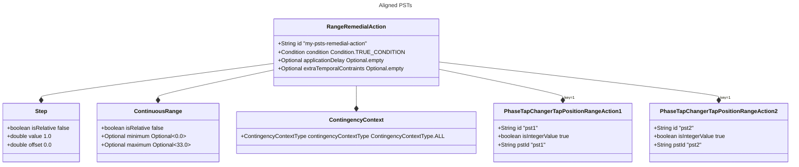

# Examples

We will provide examples:

- inspired by real optimizable operator strategies
- to justify some design choices

Those examples are not exhaustive and are just meant to illustrate the interface.

## Optimizable PST Range Action example

For example, let's consider a PST range action.  
It will have a step value of 1 and a non-relative range of 0-33.  
If you want to optimize around the current position, you will need to set a relative range of -10 to 10 for example.

Now, let's consider a set of coupled PSTs.  
The idea is that those PSTs must be in the same position at all times.  
# TODO
This is possible with `rangeActionsAndKeys` of 1 for each range action `PhaseTapChangerTapPositionRangeAction`.

It is possible to optimize without forcing integer values.  
For example, you can optimize the angle of your PST.  
But when converting a `RangeAction` to an `Action`, some range actions will be converted to integer values.  
This might be the case for a PST.

Each PhaseTapChangerTapPositionRangeAction has the flag `isIntergerValue` set to true and must have a private attribute
that points to the corresponding `PhaseTapChanger`.

Pseudo-code:

```
PhaseTapChangerTapPositionRangeAction.toAction(double setPoint) -> {
    // step 1: check that setPoint is an integer value otherwise throw an exception
    // step 2: return a PhaseTapChangerTapPositionAction for the same PhaseTapChanger and the given tap position
}
```

Now let's consider a remedial action after a contingency.  
We might want to only move the PST of a few taps in case of a contingency.  
This can be done with a relative range of -3 to 3.  
We have to take the union with the range of the PST to avoid moving outside of the range of the PST.

## Generator shut down example

Now, let's consider a generator.  
We might want to shut it down.  
So we need a range from its minimal power to its maximal power and another range with zero power.  
This example illustrates the need for union of ranges.

```
UnionRange(
  ContinuousRange(Pmin, Pmax),
  ContinuousRange(0, 0)
)
```



## Hvdc example

If so, we can use a `rangeActionsAndKeys` with 1/-1 to emulate a new set point.  
If the hdvc has a better model, those keys are not needed.  
We can also use a continuous range to explore all available setpoints without step.

## Redispatching example

Redispatching actions' behavior depends on the type of GLSK which is used by the TSOs.  
Merit order GLSKs are too complex for now and will be dealt with in a future version of the model.  
For now let us focus on proportional GLSKs.

**Simple case: no generator saturation**

Let us assume that all generators have a sufficiently low generation value such that the RD action cannot saturate them.
In that case, it is possible to compute the repartition key of each generator/load involved in the action.  
This key is used in the `rangeActionsAndKeys` attribute of the action.  
The individual `RangeAction`s are defined based on the type of the rotating machine:

- for `Generator` -> `GeneratorRangeAction` (generatorId, integerValue=false)
- for `Load` -> `LoadRangeAction` (loadId, integerValue=false)

When calling `Redispatching.toActions(double setPoint)`, the set-point is normalized by the distibution key and then
passed to the individual range action (modulo a -1 factor for load range actions).

**More complex case: generator saturation**

> TODO

## Countertrading example

Equivalent to RD but taking in account the GLSKs from both countries.  
We can use a range with step to only rely on specific volumes of CT.

