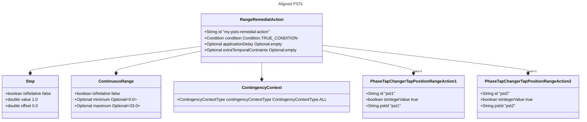

# Goal

This folder contains some work about how to better incorporate operator strategies optimizer in PowSyBl.

The base idea is to work around the existing concept of "operator strategy".
An operator strategy is composed of a set of actions applied in a given context after some conditions.
Those actions have a fixed set point and have been already optimized.

We want to optimize which actions are applied and to which set point.
This optimization is already done by several algorithms, but they do not share a common interface.
We want to standardize this interface.

# General remarks

- All names are not final, they are just placeholders and can be changed.
- This is a work in progress, it has not been reviewed, validated or tested.
- The physical units are the ones of PowSyBl (power in MW and time deltas in seconds).
- Objects with optional values are stored with a null value. The corresponding getter will return an optional.

# Examples

In the next section, we will provide examples that justify our design choices.

## Application delay

The application delay allows simulating chronologically ordered events.

For example, let's consider a PST range action that we want to optimize.  
To avoid any threshold crossing in case of any contingency, the PST has been optimized to a given position.  
This corresponds to a `ContingencyContextType.ALL`.

Now, let's consider that a contingency might occur.
We want to optimize the PST set point to avoid threshold crossing based on the time after the contingency.  
In fact, thresholds vary depending on the time after the contingency.  
We might also have a limited range of possible set points due to the physical constraints of the system.  
Furthermore, some range actions might take some time to be applied.  
This delay can be a response time or an operator application time, for example.

# Known model limitations

- It is a bit verbose to define arbitrary set points ranges (you need to define a big union).

# List of work in progress

## Model extension

We might not want to put all implementations of all interfaces in powsybl-core.

This means that we might need some ways to extend the model without modifying the core library.  
This can be tricky because of serialization and deserialization.  
To answer this need, we have not chosen between a modular design (jackson.databind.ObjectMapper) or an
extension-based design.

## TODO

- (P1) Choose how to extend our model across multiple repositories?
- (P1) Redispatching needs saturation and merit order. How to manage non-linearities?
- (P2) How to add GLSK support?
- (P3) Check which UML formats readthedocs supports (puml, mermaid ?
- Finish writing doc
- expliciter is Relative 

# OLD TEXT

## Optimizable Remedial Action

The optimizer will choose the optimal set point of the actions.

This means that we need a new object to represent the operator strategy not yet optimized "OptimizableRemedialAction".

### Examples

#### Optimizable PST Range Action

For example, let's consider a PST range action.
It will have a step value of 1 and a non-relative range of 0-33.
If you want to optimize around the current position, you will need to set a relative range of -10 to 10 for example.

Now, let's consider a set of coupled PSTs.
The idea is that those PSTs must be on the same position at all time.
This is possible with `rangeActionsAndKeys` of 1 for each range action `PhaseTapChangerTapPositionRangeAction`.

It is possible to optimize without forcing integer values.
For example, you can optimize the angle of your PST.
But when converting a `RangeAction` to an `Action`, some range actions will be converted to integer values.
This might be the case for a PST.

Each PhaseTapChangerTapPositionRangeAction has the flag `isIntergerValue` set to true and must have a private attribute
that points to the corresponding `PhaseTapChanger`.

Pseudo-code:

```
PhaseTapChangerTapPositionRangeAction.toAction(double setPoint) -> {
    // step 1: check that setPoint is an integer value otherwise throw an exception
    // step 2: return a PhaseTapChangerTapPositionAction for the same PhaseTapChanger and the given tap position
}
```

Now let's consider a remedial action after a contingency.
We might want to only move the PST of a few taps in case of a contingency.
This can be done with a relative range of -3 to 3.
We have to take the union with the range of the PST to avoid moving outside of the range of the PST.

#### Generator shut down example

Now, let's consider a generator.
We might want to shut it down.
So we need a range from its minimal power to its maximal power and another range with zero power.
This example illustrates the need for union of ranges.

```
UnionRange(
  ContinuousRange(Pmin, Pmax),
  ContinuousRange(0, 0)
)
```



#### Hvdc example

If so, we can use a `rangeActionsAndKeys` with 1/-1 to emulate a new set point.
If the hdvc has a better model, those keys are not needed.
We can also use a continuous range to explore all available setpoints without step.

#### Redispatching example

Redispatching actions' behavior depends on the type of GLSK which is used by the TSOs.
Merit order GLSKs are too complex for now and will be dealt with in a future version of the model.
For now let us focus on proportional GLSKs.

**Simple case: no generator saturation**

Let us assume that all generators have a sufficiently low generation value such that the RD action cannot saturate them.
In that case, it is possible to compute the repartition key of each generator/load involved in the action.
This key is used in the `rangeActionsAndKeys` attribute of the action.
The individual `RangeAction`s are defined based on the type of the rotating machine:

- for `Generator` -> `GeneratorRangeAction` (generatorId, integerValue=false)
- for `Load` -> `LoadRangeAction` (loadId, integerValue=false)

When calling `Redispatching.toActions(double setPoint)`, the set-point is normalized by the distibution key and then
passed to the individual range action (modulo a -1 factor for load range actions).

**More complex case: generator saturation**

> TODO

#### Countertrading

Equivalent to RD but taking in account the GLSKs from both countries.
We can use a range with step to only rely on specific volumes of CT.

# Draft

TODO:

- write this page
- add examples

Notes en pagaille:

- DMO/DP are equivalent to lead time.
- Energy constraints require to define how to interpolate between timesteps.
  This will be done by the implementations.

Turn `RangeRemedialAction` into an interface? 3 useful use-cases:

1. `SimpleRangeRemedialAction` : only one `RangeAction` involved
2. `MultipleRangeRemedialAction` : several correlated `RangeAction`s involved, each having a distribution key
3. `GlskRangeRemedialAction` : `RangeAction`s are associated with a GLSK (linear or not) -> might require a network

